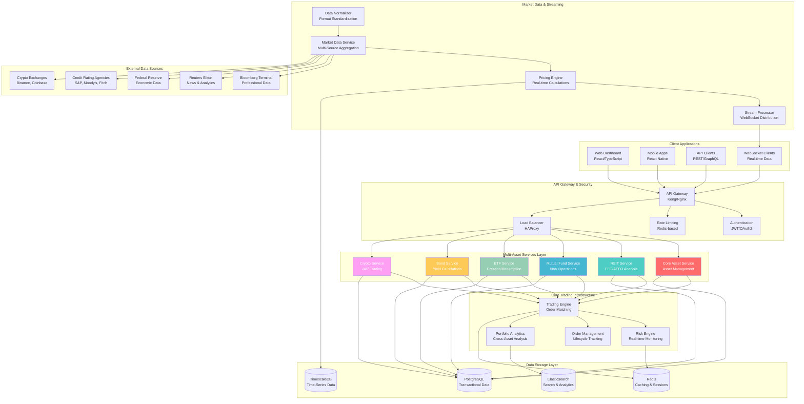
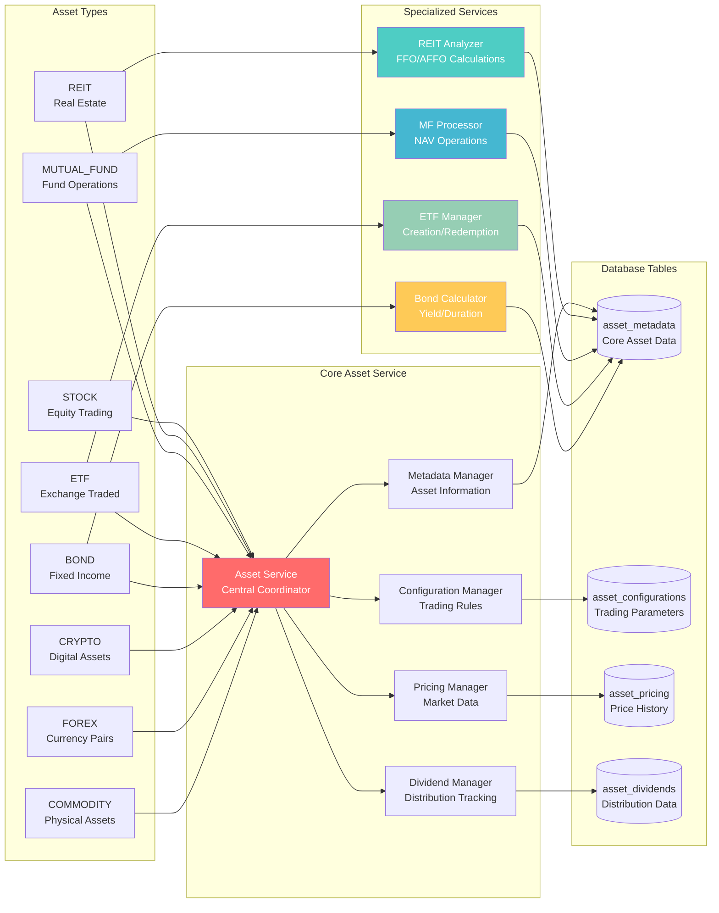
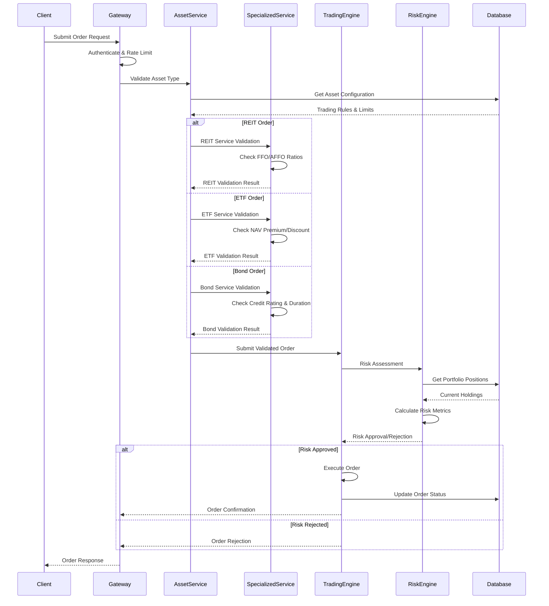
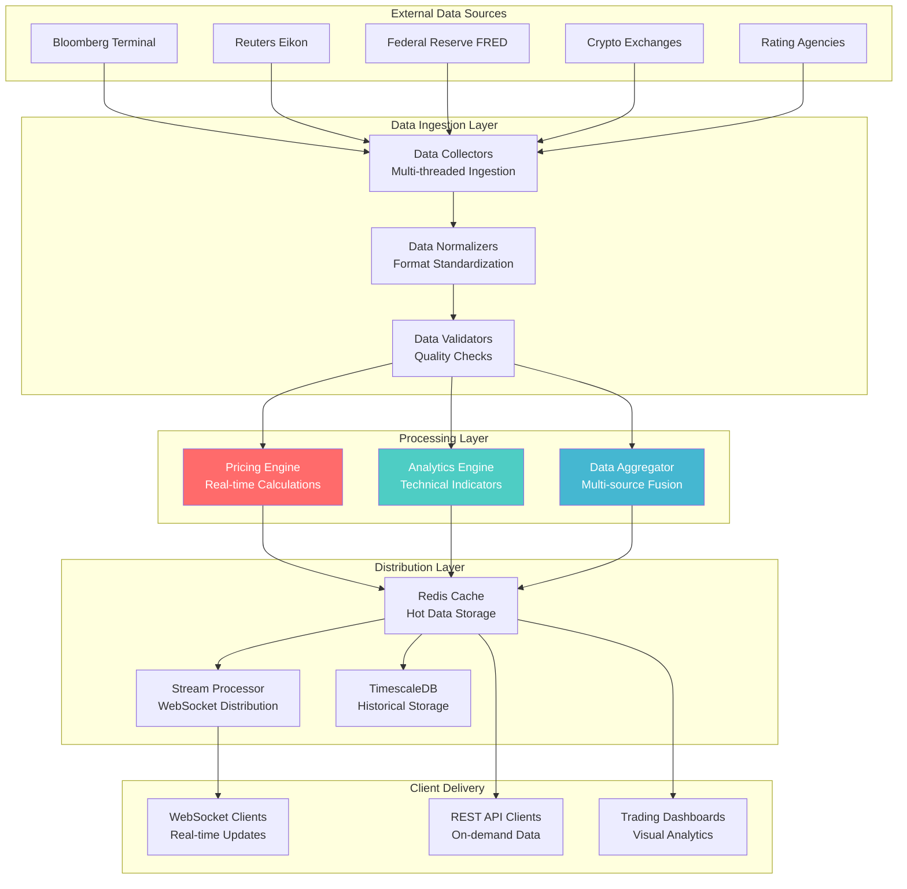
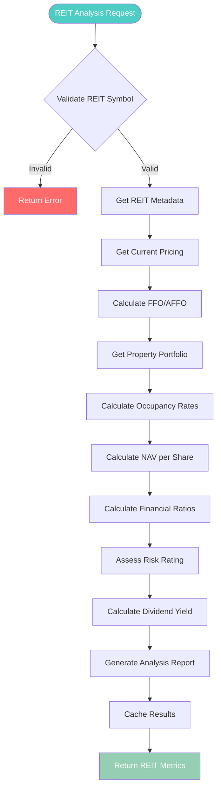
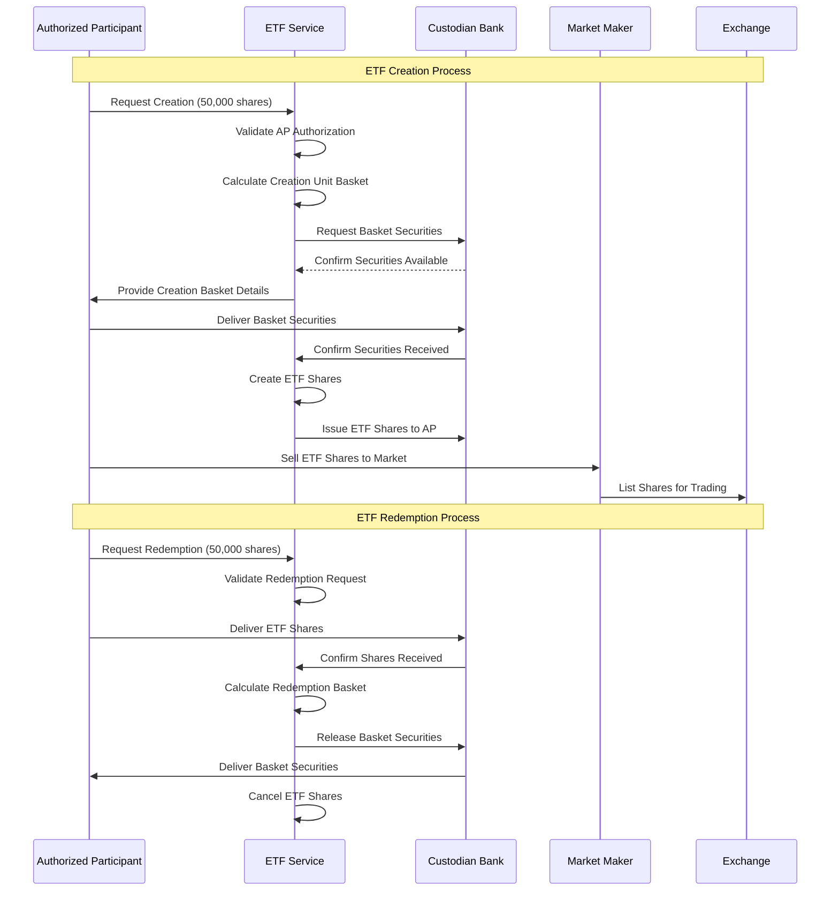
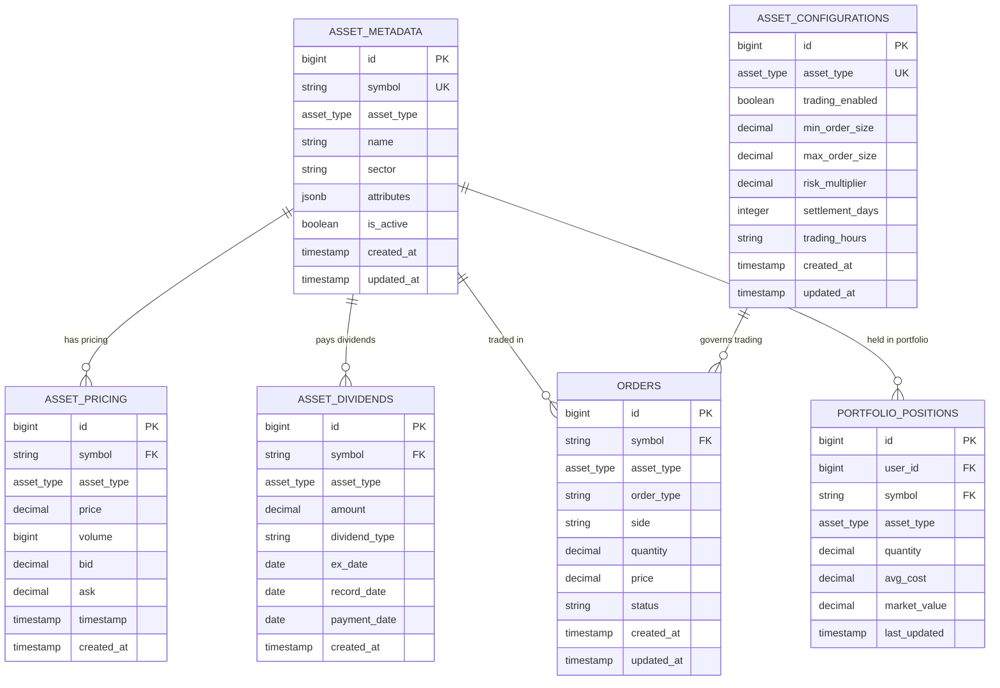
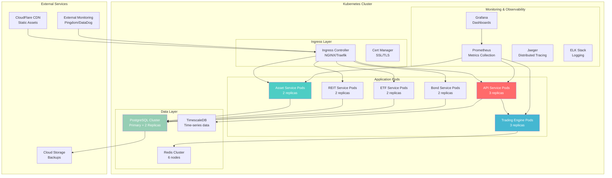
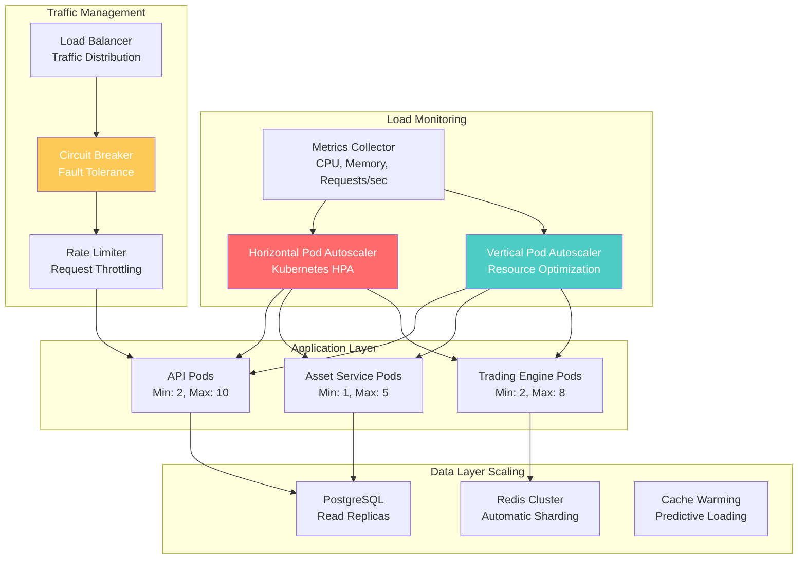

# 📊 TradSys Multi-Asset System Diagrams

This document contains comprehensive system diagrams for the TradSys Multi-Asset Trading System, illustrating the architecture, data flows, and component relationships.

---

## 🏗️ **System Architecture Diagrams**

### **1. High-Level Multi-Asset Architecture**



### **2. Asset Service Architecture**



---

## 🔄 **Data Flow Diagrams**

### **3. Multi-Asset Order Processing Flow**



### **4. Real-Time Market Data Flow**



---

## 🏦 **Asset-Specific Workflows**

### **5. REIT Analysis Workflow**



### **6. ETF Creation/Redemption Process**



### **7. Bond Yield Calculation Process**

```mermaid
flowchart TD
    START([Bond Analysis Request]) --> INPUT[Input Parameters<br/>Face Value, Coupon, Maturity, Price]
    
    INPUT --> VALIDATE{Validate Inputs}
    VALIDATE -->|Invalid| ERROR[Return Error]
    VALIDATE -->|Valid| CALC_CURRENT[Calculate Current Yield]
    
    CALC_CURRENT --> INIT_YTM[Initialize YTM Guess<br/>YTM = Coupon Rate]
    INIT_YTM --> NEWTON_RAPHSON[Newton-Raphson Iteration]
    
    NEWTON_RAPHSON --> CALC_PV[Calculate Present Value<br/>Using Current YTM]
    CALC_PV --> CALC_DERIVATIVE[Calculate PV Derivative]
    CALC_DERIVATIVE --> UPDATE_YTM[Update YTM Estimate]
    
    UPDATE_YTM --> CONVERGED{Converged?<br/>|New YTM - Old YTM| < 0.0001}
    CONVERGED -->|No| NEWTON_RAPHSON
    CONVERGED -->|Yes| CALC_DURATION[Calculate Duration]
    
    CALC_DURATION --> CALC_CONVEXITY[Calculate Convexity]
    CALC_CONVEXITY --> CALC_ACCRUED[Calculate Accrued Interest]
    CALC_ACCRUED --> ASSESS_CREDIT[Assess Credit Risk]
    
    ASSESS_CREDIT --> PROJECT_CF[Project Cash Flows]
    PROJECT_CF --> GENERATE_REPORT[Generate Bond Report]
    GENERATE_REPORT --> RETURN[Return Bond Metrics]
    
    style START fill:#FECA57,color:#fff
    style NEWTON_RAPHSON fill:#FF6B6B,color:#fff
    style RETURN fill:#96CEB4,color:#fff
    style ERROR fill:#FF6B6B,color:#fff
```

---

## 📊 **Database Schema Diagrams**

### **8. Multi-Asset Database Schema**



---

## 🚀 **Deployment Architecture**

### **9. Kubernetes Deployment Diagram**



---

## 📈 **Performance & Scaling Diagrams**

### **10. Auto-Scaling Architecture**



---

This comprehensive diagram collection provides visual documentation for all aspects of the TradSys Multi-Asset Trading System, from high-level architecture to detailed workflows and deployment strategies.
