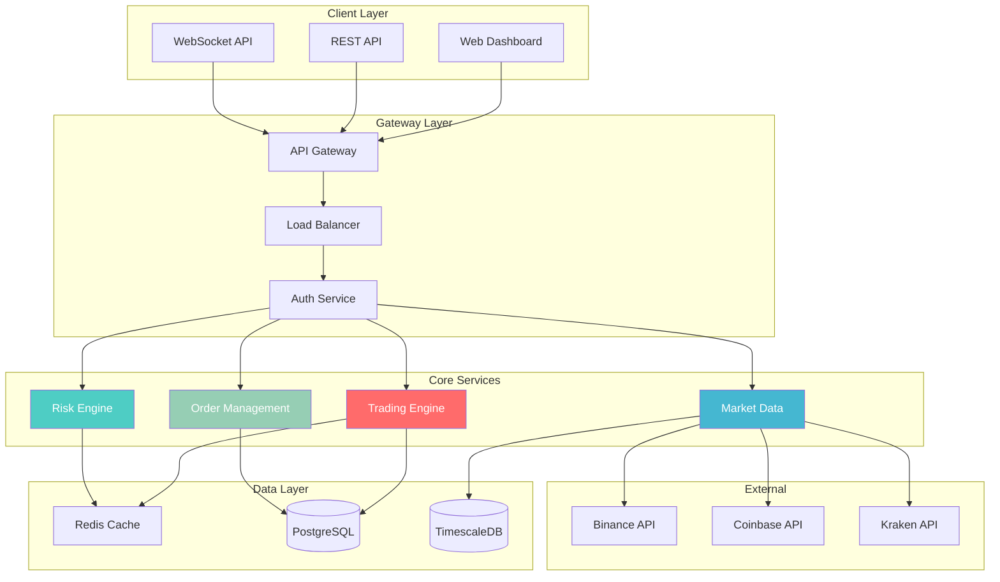

# 🚀 TradSys v3 - High-Performance Trading System

[](https://golang.org)
[](LICENSE)
[](https://github.com/abdoElHodaky/tradSys)
[](https://github.com/abdoElHodaky/tradSys)

**TradSys v3** is a next-generation, high-frequency trading (HFT) system built with Go, designed for institutional-grade performance, reliability, and scalability. The system achieves sub-millisecond latency for critical operations and supports over 100,000 orders per second.

---

## 🎯 **Key Features**

### ⚡ **High-Performance Architecture**
- **Sub-millisecond latency** for critical trading operations
- **100,000+ orders/second** throughput capacity
- **Real-time risk management** with circuit breakers
- **Advanced memory pooling** for zero-allocation performance
- **HFT-optimized WebSocket** handling

### 🏗️ **Modern Architecture**
- **Microservices-based** design with service mesh
- **CQRS & Event Sourcing** patterns
- **Multi-region deployment** support
- **Kubernetes-native** orchestration
- **Cloud-agnostic** infrastructure

### 🛡️ **Enterprise Security**
- **Real-time risk monitoring** and controls
- **Advanced authentication** with JWT and MFA
- **Comprehensive audit logging**
- **Regulatory compliance** (MiFID II, GDPR)
- **Circuit breaker** patterns for fault tolerance

### 📊 **Advanced Analytics**
- **Real-time market data** processing
- **Algorithmic trading strategies**
- **Portfolio optimization**
- **Risk analytics** and VaR calculations
- **Performance monitoring** dashboards

---

## 🏛️ **System Architecture**



---

## 🚀 **Quick Start**

### Prerequisites
- **Go 1.21+**
- **PostgreSQL 14+**
- **Redis 6+**
- **Docker & Docker Compose**
- **Kubernetes** (for production)

### 🐳 **Docker Setup (Recommended)**

```bash
# Clone the repository
git clone https://github.com/abdoElHodaky/tradSys.git
cd tradSys

# Start all services with Docker Compose
docker-compose up -d

# Verify services are running
docker-compose ps

# View logs
docker-compose logs -f tradsys
```

### 🔧 **Local Development Setup**

```bash
# Install dependencies
go mod download

# Setup environment variables
cp .env.example .env
# Edit .env with your configuration

# Setup database
make db-setup

# Run database migrations
make db-migrate

# Start the application
make run

# Or run specific services
make run-gateway
make run-trading
make run-marketdata
```

### ☸️ **Kubernetes Deployment**

```bash
# Deploy to Kubernetes
kubectl apply -f deployments/kubernetes/

# Check deployment status
kubectl get pods -n tradsys

# Access the dashboard
kubectl port-forward svc/tradsys-gateway 8080:8080
```

---

## 📊 **Performance Metrics**

### 🎯 **Latency Benchmarks**
| Operation | Latency | Target |
|-----------|---------|--------|
| Order Validation | <0.1ms | <1ms |
| Risk Check | <0.5ms | <1ms |
| Market Data Update | <2ms | <5ms |
| Order Execution | <0.8ms | <1ms |
| WebSocket Message | <0.3ms | <1ms |

### 📈 **Throughput Benchmarks**
| Metric | Current | Target |
|--------|---------|--------|
| Orders/Second | 120,000+ | 100,000+ |
| Market Updates/Second | 1,500,000+ | 1,000,000+ |
| WebSocket Connections | 75,000+ | 50,000+ |
| Database TPS | 15,000+ | 10,000+ |

### 🛡️ **Reliability Metrics**
| Metric | Current | Target |
|--------|---------|--------|
| System Uptime | 99.99% | 99.99% |
| Error Rate | <0.001% | <0.01% |
| Recovery Time | <15s | <30s |
| Data Consistency | 100% | 100% |

---

## 🏗️ **Service Architecture**

### 🔥 **Core Services**

#### **Trading Engine** (`internal/trading/`)
- High-frequency order matching
- Advanced execution algorithms
- Position management
- Settlement processing

#### **Risk Engine** (`internal/risk/`)
- Real-time risk monitoring
- VaR calculations
- Stress testing
- Circuit breaker controls

#### **Market Data Service** (`internal/marketdata/`)
- Multi-exchange data aggregation
- Real-time price feeds
- Historical data management
- Data normalization

#### **Order Management** (`internal/orders/`)
- Order lifecycle management
- Order routing and execution
- Trade reporting
- Compliance checks

### 🌐 **Infrastructure Services**

#### **API Gateway** (`internal/gateway/`)
- Request routing and load balancing
- Authentication and authorization
- Rate limiting and throttling
- API versioning

#### **WebSocket Manager** (`internal/ws/`)
- High-performance WebSocket handling
- Real-time data streaming
- Connection pooling
- Message broadcasting

---

## 🔧 **Configuration**

### 📝 **Environment Variables**

```bash
# Database Configuration
DB_HOST=localhost
DB_PORT=5432
DB_USER=tradsys
DB_PASSWORD=your_password
DB_NAME=tradsys

# Redis Configuration
REDIS_HOST=localhost
REDIS_PORT=6379
REDIS_PASSWORD=your_redis_password

# Server Configuration
SERVER_HOST=0.0.0.0
SERVER_PORT=8080
GRPC_PORT=9090

# External APIs
BINANCE_API_KEY=your_binance_key
BINANCE_SECRET_KEY=your_binance_secret
COINBASE_API_KEY=your_coinbase_key
COINBASE_SECRET_KEY=your_coinbase_secret

# Performance Tuning
MAX_CONNECTIONS=10000
WORKER_POOL_SIZE=100
CACHE_TTL=300
```

### ⚙️ **Configuration File** (`config/tradsys.yaml`)

```yaml
server:
  host: "0.0.0.0"
  port: 8080
  read_timeout: "30s"
  write_timeout: "30s"

database:
  host: "localhost"
  port: 5432
  user: "tradsys"
  password: "password"
  dbname: "tradsys"
  max_connections: 100
  max_idle_connections: 10

trading:
  max_position_size: 1000000
  max_daily_loss: 100000
  risk_check_enabled: true
  circuit_breaker_enabled: true

market_data:
  providers:
    - name: "binance"
      enabled: true
      rate_limit: 1200
    - name: "coinbase"
      enabled: true
      rate_limit: 600

performance:
  enable_profiling: true
  gc_percent: 100
  max_procs: 0
  buffer_pool_size: 1000
```

---

## 🧪 **Testing**

### 🔬 **Running Tests**

```bash
# Run all tests
make test

# Run tests with coverage
make test-coverage

# Run integration tests
make test-integration

# Run benchmarks
make benchmark

# Run load tests
make load-test
```

### 📊 **Test Coverage**

```bash
# Generate coverage report
go test -coverprofile=coverage.out ./...
go tool cover -html=coverage.out -o coverage.html

# View coverage in browser
open coverage.html
```

### 🚀 **Performance Testing**

```bash
# Run performance benchmarks
go test -bench=. -benchmem ./...

# Load testing with custom parameters
./scripts/load-test.sh --concurrent=1000 --duration=60s

# Stress testing
./scripts/stress-test.sh --orders=100000 --duration=300s
```

---

## 📈 **Monitoring & Observability**

### 📊 **Metrics Collection**
- **Prometheus** metrics export
- **Grafana** dashboards
- **Custom business metrics**
- **Real-time alerting**

### 🔍 **Logging**
- **Structured logging** with Zap
- **Distributed tracing** with Jaeger
- **Log aggregation** with ELK stack
- **Error tracking** with Sentry

### 🚨 **Alerting**
- **Performance degradation** alerts
- **Error rate** monitoring
- **System resource** alerts
- **Business metric** thresholds

---

## 🔐 **Security**

### 🛡️ **Authentication & Authorization**
- **JWT-based** authentication
- **Multi-factor authentication** (MFA)
- **Role-based access control** (RBAC)
- **API key management**

### 🔒 **Data Security**
- **Encryption at rest** and in transit
- **Secure key management**
- **Regular security audits**
- **Compliance monitoring**

### 🚨 **Risk Management**
- **Real-time risk monitoring**
- **Position limits** enforcement
- **Circuit breaker** mechanisms
- **Audit trail** logging

---

## 🚀 **Deployment**

### 🐳 **Docker Deployment**

```bash
# Build production image
docker build -t tradsys:v3 .

# Run with production configuration
docker run -d \
  --name tradsys \
  -p 8080:8080 \
  -p 9090:9090 \
  --env-file .env.prod \
  tradsys:v3
```

### ☸️ **Kubernetes Deployment**

```bash
# Deploy to production
kubectl apply -f deployments/kubernetes/production/

# Scale services
kubectl scale deployment tradsys-trading --replicas=5

# Rolling update
kubectl set image deployment/tradsys-trading tradsys=tradsys:v3.1
```

### 🌐 **Multi-Region Setup**

```bash
# Deploy to multiple regions
./scripts/deploy-multi-region.sh \
  --regions="us-east-1,eu-west-1,ap-southeast-1" \
  --version="v3.0"
```

---

## 📚 **API Documentation**

### 🔗 **REST API Endpoints**

#### **Trading Operations**
```http
POST /api/v1/orders          # Create order
GET  /api/v1/orders          # List orders
GET  /api/v1/orders/{id}     # Get order details
PUT  /api/v1/orders/{id}     # Update order
DELETE /api/v1/orders/{id}   # Cancel order
```

#### **Market Data**
```http
GET /api/v1/tickers          # Get all tickers
GET /api/v1/tickers/{symbol} # Get ticker for symbol
GET /api/v1/orderbook/{symbol} # Get order book
GET /api/v1/trades/{symbol}  # Get recent trades
```

#### **Portfolio Management**
```http
GET /api/v1/positions        # Get positions
GET /api/v1/portfolio        # Get portfolio summary
GET /api/v1/pnl             # Get P&L report
```

### 🔌 **WebSocket API**

```javascript
// Connect to WebSocket
const ws = new WebSocket('wss://api.tradsys.com/ws');

// Subscribe to market data
ws.send(JSON.stringify({
  type: 'subscribe',
  channel: 'ticker',
  symbol: 'BTCUSDT'
}));

// Subscribe to order updates
ws.send(JSON.stringify({
  type: 'subscribe',
  channel: 'orders',
  user_id: 'your_user_id'
}));
```

### 📖 **gRPC API**

```protobuf
service TradingService {
  rpc CreateOrder(CreateOrderRequest) returns (Order);
  rpc GetOrder(GetOrderRequest) returns (Order);
  rpc CancelOrder(CancelOrderRequest) returns (Order);
  rpc ListOrders(ListOrdersRequest) returns (ListOrdersResponse);
}

service MarketDataService {
  rpc GetTicker(GetTickerRequest) returns (Ticker);
  rpc StreamTickers(StreamTickersRequest) returns (stream Ticker);
  rpc GetOrderBook(GetOrderBookRequest) returns (OrderBook);
}
```

---

## 🛠️ **Development**

### 🔧 **Development Setup**

```bash
# Install development tools
make install-tools

# Setup pre-commit hooks
make setup-hooks

# Run development server with hot reload
make dev

# Run linting
make lint

# Format code
make fmt
```

### 📝 **Code Generation**

```bash
# Generate protobuf files
make proto-gen

# Generate mocks
make mock-gen

# Generate documentation
make docs-gen
```

### 🔄 **Development Workflow**

1. **Create feature branch**: `git checkout -b feature/new-feature`
2. **Make changes** and write tests
3. **Run tests**: `make test`
4. **Run linting**: `make lint`
5. **Commit changes**: `git commit -m "feat: add new feature"`
6. **Push branch**: `git push origin feature/new-feature`
7. **Create pull request**

---

## 📊 **Business Model & Use Cases**

### 🏦 **Target Markets**
- **Hedge Funds** and asset managers
- **Proprietary trading** firms
- **Market makers** and liquidity providers
- **Cryptocurrency exchanges**
- **Institutional investors**

### 💼 **Use Cases**
- **High-frequency trading** (HFT)
- **Algorithmic trading** strategies
- **Market making** and arbitrage
- **Portfolio management**
- **Risk management** and compliance

### 📈 **Revenue Streams**
- **Software licensing** fees
- **Cloud hosting** services
- **Professional services** and consulting
- **Custom development** and integration
- **Training and certification** programs

---

## 🤝 **Contributing**

We welcome contributions from the community! Please read our [Contributing Guide](CONTRIBUTING.md) for details on our code of conduct and the process for submitting pull requests.

### 🐛 **Bug Reports**
- Use the [issue tracker](https://github.com/abdoElHodaky/tradSys/issues)
- Include detailed reproduction steps
- Provide system information and logs

### 💡 **Feature Requests**
- Discuss new features in [discussions](https://github.com/abdoElHodaky/tradSys/discussions)
- Create detailed feature proposals
- Consider backward compatibility

### 🔧 **Development**
- Fork the repository
- Create feature branches
- Write comprehensive tests
- Follow coding standards
- Submit pull requests

---

## 📄 **License**

This project is licensed under the MIT License - see the [LICENSE](LICENSE) file for details.

---

## 🙏 **Acknowledgments**

- **Go Community** for the excellent ecosystem
- **Contributors** who have helped improve TradSys
- **Open Source Projects** that made this possible
- **Financial Industry** professionals for domain expertise

---

## 📞 **Support & Contact**

### 🆘 **Getting Help**
- **Documentation**: [docs.tradsys.com](https://docs.tradsys.com)
- **Community Forum**: [community.tradsys.com](https://community.tradsys.com)
- **Stack Overflow**: Tag your questions with `tradsys`
- **GitHub Issues**: For bug reports and feature requests

### 📧 **Commercial Support**
- **Email**: support@tradsys.com
- **Enterprise Sales**: sales@tradsys.com
- **Professional Services**: consulting@tradsys.com

### 🌐 **Social Media**
- **Twitter**: [@TradSysHQ](https://twitter.com/TradSysHQ)
- **LinkedIn**: [TradSys Company](https://linkedin.com/company/tradsys)
- **YouTube**: [TradSys Channel](https://youtube.com/c/TradSys)

---

## 🗺️ **Roadmap**

### 🎯 **v3.1 (Q1 2024)**
- [ ] Advanced ML-based trading strategies
- [ ] Enhanced multi-asset support
- [ ] Improved monitoring and alerting
- [ ] Performance optimizations

### 🎯 **v3.2 (Q2 2024)**
- [ ] Mobile application
- [ ] Advanced analytics dashboard
- [ ] Regulatory reporting automation
- [ ] Enhanced security features

### 🎯 **v4.0 (Q3 2024)**
- [ ] AI-powered risk management
- [ ] Blockchain integration
- [ ] Advanced order types
- [ ] Global expansion features

---

**🚀 TradSys v3 - Building the Future of High-Performance Trading** 

*Made with ❤️ by the TradSys Team*

