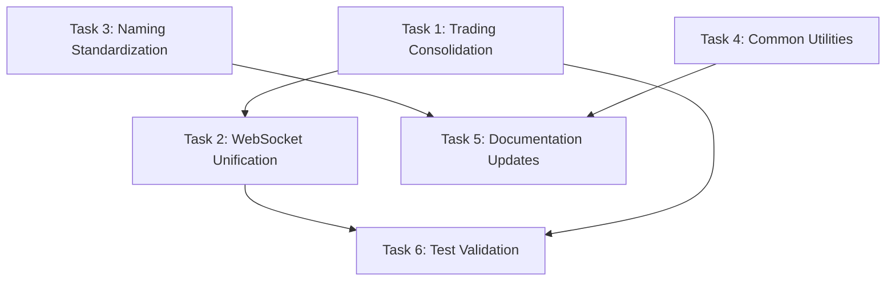

# Child Agent Task Distribution Plan

**Coordination Date**: October 25, 2024  
**Parent Agent**: Main TradSys Agent (126353)  
**Project Phase**: Architectural Optimization (Phase 16)  
**Total Estimated Effort**: 11 days with parallel execution  

## Task Distribution Strategy

### **High-Priority Sequential Tasks** (Main Agent)
These tasks require architectural knowledge and must be executed sequentially:

#### **Task 1: Trading Package Consolidation**
- **Agent**: Main Agent (126353)
- **Priority**: Critical
- **Estimated Effort**: 3 days
- **Dependencies**: None
- **Description**: Merge `internal/trading/` and `services/trading/` packages
- **Files Affected**: 23 files
- **Risk Level**: Medium
- **Success Criteria**: 
  - All functionality preserved
  - Import paths updated
  - Tests passing
  - No performance regression

#### **Task 2: WebSocket Implementation Unification**
- **Agent**: Main Agent (126353)
- **Priority**: Critical
- **Estimated Effort**: 2 days
- **Dependencies**: Task 1 completion
- **Description**: Consolidate `internal/ws/` and `services/websocket/` packages
- **Files Affected**: 18 files
- **Risk Level**: Medium
- **Success Criteria**:
  - Single WebSocket implementation
  - All connections maintained
  - Performance preserved
  - Clean interface boundaries

### **Medium-Priority Parallel Tasks** (Child Agents)
These tasks can be executed in parallel by child agents:

#### **Task 3: Naming Convention Standardization**
- **Agent**: Child Agent (TBD)
- **Priority**: Medium
- **Estimated Effort**: 2 days
- **Dependencies**: None (can run in parallel)
- **Description**: Apply consistent naming patterns across codebase
- **Files Affected**: 50 files
- **Risk Level**: Low
- **Deliverables**:
  - Standardize handler naming: `*_handler.go`
  - Unify service interface patterns
  - Apply Go naming conventions consistently
  - Update documentation references

#### **Task 4: Common Utilities Consolidation**
- **Agent**: Child Agent (TBD)
- **Priority**: Medium
- **Estimated Effort**: 1 day
- **Dependencies**: None (can run in parallel)
- **Description**: Consolidate common utilities into `pkg/common/`
- **Files Affected**: 9 files
- **Risk Level**: Low
- **Deliverables**:
  - Merge `internal/common/`, `services/common/` into `pkg/common/`
  - Update import paths
  - Validate functionality preservation
  - Remove duplicate code

#### **Task 5: Documentation Updates**
- **Agent**: Child Agent (TBD)
- **Priority**: Low
- **Estimated Effort**: 1 day
- **Dependencies**: Tasks 1-4 completion
- **Description**: Update documentation to reflect architectural changes
- **Files Affected**: 15 files
- **Risk Level**: Low
- **Deliverables**:
  - Update architecture diagrams
  - Revise API documentation
  - Update deployment guides
  - Consolidate overlapping documentation

#### **Task 6: Test Validation and Updates**
- **Agent**: Child Agent (TBD)
- **Priority**: High
- **Estimated Effort**: 2 days
- **Dependencies**: Tasks 1-2 completion
- **Description**: Validate and update tests for architectural changes
- **Files Affected**: 25 test files
- **Risk Level**: Low
- **Deliverables**:
  - Update import paths in tests
  - Validate test coverage maintenance
  - Update integration tests
  - Performance test validation

## Coordination Protocols

### **Communication Framework**
- **Primary Channel**: GitHub Issues and PR comments
- **Status Updates**: Daily progress reports
- **Conflict Resolution**: Main agent coordination
- **Emergency Escalation**: Immediate notification for blocking issues

### **Progress Tracking**
- **Task Status**: Not Started → In Progress → Review → Complete
- **Daily Standups**: Progress updates and blocker identification
- **Milestone Tracking**: Weekly progress reviews
- **Quality Gates**: Code review and testing validation

### **Dependency Management**


### **Conflict Resolution**
- **Import Conflicts**: Main agent resolves architectural decisions
- **Naming Conflicts**: Follow established naming convention document
- **Test Conflicts**: Maintain existing test coverage standards
- **Performance Conflicts**: Validate against established benchmarks

## Child Agent Assignments

### **Preferred Agent Capabilities**
- **Naming Standardization**: Agent with Go expertise and pattern recognition
- **Common Utilities**: Agent with refactoring and dependency management skills
- **Documentation**: Agent with technical writing and architecture documentation skills
- **Test Validation**: Agent with testing framework expertise and quality assurance

### **Agent Selection Criteria**
- **Go Language Proficiency**: High
- **Refactoring Experience**: Medium to High
- **Testing Framework Knowledge**: Medium
- **Documentation Skills**: Medium
- **Parallel Execution Capability**: High

## Success Metrics

### **Quantitative Targets**
- **Directory Reduction**: 135 → 100 directories (26% reduction)
- **Duplication Elimination**: 50 → 5 duplicate files (90% reduction)
- **Naming Consistency**: 75% → 100% compliance
- **Test Coverage**: Maintain >80% coverage
- **Performance**: No regression in benchmarks

### **Qualitative Goals**
- **Code Maintainability**: Improved through consolidation
- **Developer Experience**: Enhanced through consistent naming
- **Architectural Clarity**: Strengthened through unification
- **Documentation Quality**: Updated and consolidated

## Risk Mitigation

### **Technical Risks**
- **Import Breakage**: Incremental changes with validation
- **Functionality Loss**: Comprehensive testing at each step
- **Performance Regression**: Continuous benchmarking
- **Merge Conflicts**: Coordinated branch management

### **Coordination Risks**
- **Task Dependencies**: Clear dependency mapping and communication
- **Agent Availability**: Backup agent assignments
- **Communication Gaps**: Regular status updates and check-ins
- **Quality Variations**: Standardized review processes

## Implementation Timeline

### **Week 1: Sequential Tasks (Main Agent)**
- **Days 1-3**: Trading package consolidation
- **Days 4-5**: WebSocket implementation unification

### **Week 2: Parallel Tasks (Child Agents)**
- **Days 1-2**: Naming standardization + Common utilities consolidation
- **Days 3-4**: Test validation + Documentation updates
- **Day 5**: Integration and final validation

### **Milestones**
- **Day 3**: Trading consolidation complete
- **Day 5**: WebSocket unification complete
- **Day 7**: Parallel tasks 50% complete
- **Day 9**: All tasks complete, integration testing
- **Day 10**: Final validation and documentation
- **Day 11**: Deployment preparation and handoff

## Quality Assurance

### **Code Review Process**
- **Main Agent Reviews**: All architectural changes
- **Peer Reviews**: Child agent cross-reviews
- **Automated Validation**: CI/CD pipeline checks
- **Performance Validation**: Benchmark comparisons

### **Testing Strategy**
- **Unit Tests**: Maintain coverage during refactoring
- **Integration Tests**: Validate system integration
- **Performance Tests**: Ensure no regression
- **End-to-End Tests**: Validate complete workflows

### **Deployment Validation**
- **Staging Deployment**: Test architectural changes
- **Performance Monitoring**: Validate optimization benefits
- **Rollback Procedures**: Maintain ability to revert changes
- **Production Readiness**: Final validation checklist

## Communication Templates

### **Daily Status Update Template**
```
**Agent**: [Agent ID]
**Task**: [Task Name]
**Status**: [Not Started/In Progress/Review/Complete]
**Progress**: [Percentage complete]
**Blockers**: [Any blocking issues]
**Next Steps**: [Planned work for next day]
**ETA**: [Estimated completion date]
```

### **Issue Escalation Template**
```
**Priority**: [Low/Medium/High/Critical]
**Task Affected**: [Task Name]
**Issue Description**: [Detailed description]
**Impact**: [Effect on timeline/quality]
**Proposed Resolution**: [Suggested solution]
**Assistance Needed**: [Type of help required]
```

## Success Celebration

Upon successful completion of all tasks:
- **Performance Metrics**: Document achieved improvements
- **Lessons Learned**: Capture coordination insights
- **Best Practices**: Document successful patterns
- **Team Recognition**: Acknowledge contributions
- **Next Phase Preparation**: Transition to Phase 17

---

**Coordination Lead**: Main Agent (126353)  
**Last Updated**: October 25, 2024  
**Next Review**: Daily during execution phase  
