# 📐 TradSys v2 System Diagrams

<div align="center">


**Complete Visual Documentation of TradSys v2 Platform**  
*Resimplified Architecture - 35% Complexity Reduction*

---

</div>

## 📑 Table of Contents

1. [v2 Resimplified Architecture](#-v2-resimplified-architecture) ⭐ **NEW**
2. [Business Architecture](#-business-architecture)
3. [Software Architecture](#-software-architecture)
4. [System Architecture](#-system-architecture)
5. [Infrastructure Architecture](#-infrastructure-architecture)
6. [Data Architecture](#-data-architecture)
7. [Security Architecture](#-security-architecture)
8. [Deployment Architecture](#-deployment-architecture)
9. [Network Architecture](#-network-architecture)

---

## 🚀 v2 Resimplified Architecture

### 1.1 Structural Improvements Overview

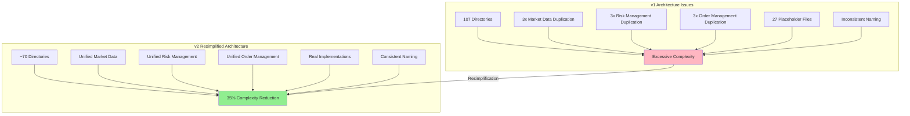
```mermaid
graph TB
    subgraph "v1 Architecture Issues"
        A1[107 Directories] --> B1[Excessive Complexity]
        A2[3x Market Data Duplication] --> B1
        A3[3x Risk Management Duplication] --> B1
        A4[3x Order Management Duplication] --> B1
        A5[27 Placeholder Files] --> B1
        A6[Inconsistent Naming] --> B1
    end
    
    subgraph "v2 Resimplified Architecture"
        C1[~70 Directories] --> D1[35% Complexity Reduction]
        C2[Unified Market Data] --> D1
        C3[Unified Risk Management] --> D1
        C4[Unified Order Management] --> D1
        C5[Real Implementations] --> D1
        C6[Consistent Naming] --> D1
    end
    
    B1 --> |Resimplification| D1
    
    style D1 fill:#90EE90
    style B1 fill:#FFB6C1
```

### 1.2 New Unified Directory Structure

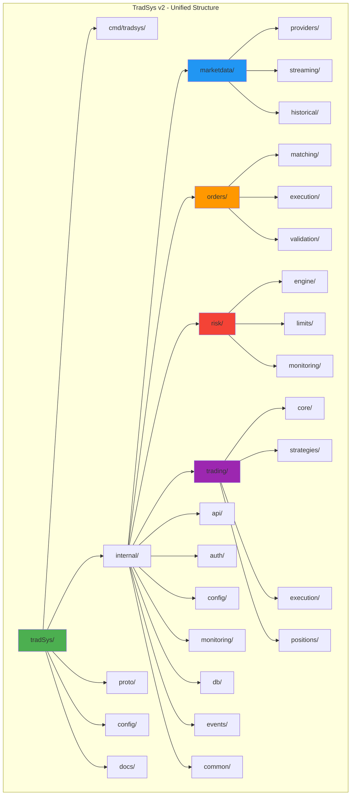
```mermaid
graph TD
    subgraph "TradSys v2 - Unified Structure"
        A[tradSys/] --> B[cmd/tradsys/]
        A --> C[internal/]
        A --> D[proto/]
        A --> E[config/]
        A --> F[docs/]
        
        C --> G[marketdata/]
        C --> H[orders/]
        C --> I[risk/]
        C --> J[trading/]
        C --> K[api/]
        C --> L[auth/]
        C --> M[config/]
        C --> N[monitoring/]
        C --> O[db/]
        C --> P[events/]
        C --> Q[common/]
        
        G --> G1[providers/]
        G --> G2[streaming/]
        G --> G3[historical/]
        
        H --> H1[matching/]
        H --> H2[execution/]
        H --> H3[validation/]
        
        I --> I1[engine/]
        I --> I2[limits/]
        I --> I3[monitoring/]
        
        J --> J1[core/]
        J --> J2[strategies/]
        J --> J3[execution/]
        J --> J4[positions/]
    end
    
    style A fill:#4CAF50
    style G fill:#2196F3
    style H fill:#FF9800
    style I fill:#F44336
    style J fill:#9C27B0
```

### 1.3 Service Consolidation Map

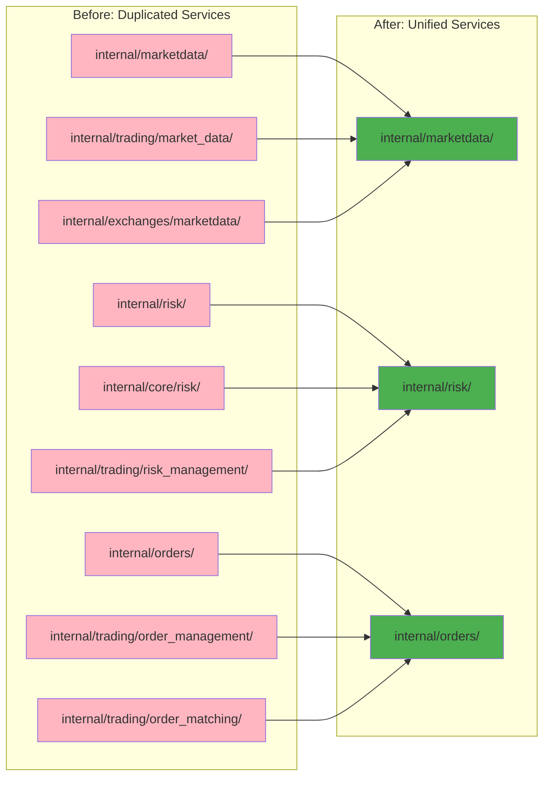
```mermaid
graph LR
    subgraph "Before: Duplicated Services"
        A1[internal/marketdata/]
        A2[internal/trading/market_data/]
        A3[internal/exchanges/marketdata/]
        
        B1[internal/risk/]
        B2[internal/core/risk/]
        B3[internal/trading/risk_management/]
        
        C1[internal/orders/]
        C2[internal/trading/order_management/]
        C3[internal/trading/order_matching/]
    end
    
    subgraph "After: Unified Services"
        D1[internal/marketdata/]
        D2[internal/risk/]
        D3[internal/orders/]
    end
    
    A1 --> D1
    A2 --> D1
    A3 --> D1
    
    B1 --> D2
    B2 --> D2
    B3 --> D2
    
    C1 --> D3
    C2 --> D3
    C3 --> D3
    
    style D1 fill:#4CAF50
    style D2 fill:#4CAF50
    style D3 fill:#4CAF50
    style A1 fill:#FFB6C1
    style A2 fill:#FFB6C1
    style A3 fill:#FFB6C1
    style B1 fill:#FFB6C1
    style B2 fill:#FFB6C1
    style B3 fill:#FFB6C1
    style C1 fill:#FFB6C1
    style C2 fill:#FFB6C1
    style C3 fill:#FFB6C1
```

### 1.4 Implementation Status

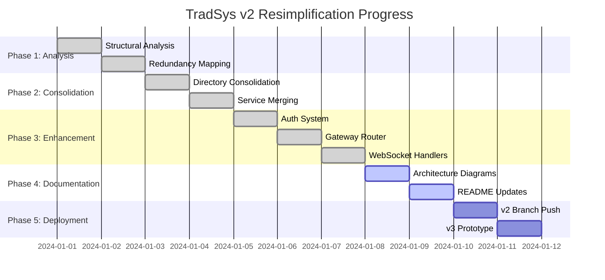
```mermaid
gantt
    title TradSys v2 Resimplification Progress
    dateFormat  YYYY-MM-DD
    section Phase 1: Analysis
    Structural Analysis     :done, analysis, 2024-01-01, 2024-01-02
    Redundancy Mapping      :done, mapping, 2024-01-02, 2024-01-03
    
    section Phase 2: Consolidation
    Directory Consolidation :done, consolidation, 2024-01-03, 2024-01-04
    Service Merging        :done, merging, 2024-01-04, 2024-01-05
    
    section Phase 3: Enhancement
    Auth System            :done, auth, 2024-01-05, 2024-01-06
    Gateway Router         :done, gateway, 2024-01-06, 2024-01-07
    WebSocket Handlers     :done, ws, 2024-01-07, 2024-01-08
    
    section Phase 4: Documentation
    Architecture Diagrams  :active, docs, 2024-01-08, 2024-01-09
    README Updates         :active, readme, 2024-01-09, 2024-01-10
    
    section Phase 5: Deployment
    v2 Branch Push         :v2push, 2024-01-10, 2024-01-11
    v3 Prototype          :v3proto, 2024-01-11, 2024-01-12
```

---

## 💼 Business Architecture

### 1.1 Business Model Canvas

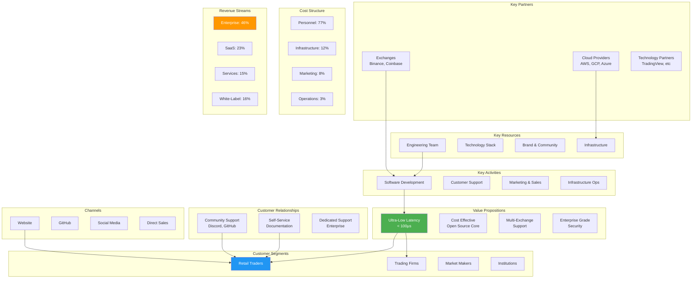
```mermaid
graph TB
    subgraph "Key Partners"
        A1[Exchanges<br/>Binance, Coinbase]
        A2[Cloud Providers<br/>AWS, GCP, Azure]
        A3[Technology Partners<br/>TradingView, etc]
    end
    
    subgraph "Key Activities"
        B1[Software Development]
        B2[Customer Support]
        B3[Marketing & Sales]
        B4[Infrastructure Ops]
    end
    
    subgraph "Value Propositions"
        C1[Ultra-Low Latency<br/>< 100μs]
        C2[Cost Effective<br/>Open Source Core]
        C3[Multi-Exchange<br/>Support]
        C4[Enterprise Grade<br/>Security]
    end
    
    subgraph "Customer Relationships"
        D1[Community Support<br/>Discord, GitHub]
        D2[Self-Service<br/>Documentation]
        D3[Dedicated Support<br/>Enterprise]
    end
    
    subgraph "Customer Segments"
        E1[Retail Traders]
        E2[Trading Firms]
        E3[Market Makers]
        E4[Institutions]
    end
    
    subgraph "Key Resources"
        F1[Engineering Team]
        F2[Technology Stack]
        F3[Brand & Community]
        F4[Infrastructure]
    end
    
    subgraph "Channels"
        G1[Website]
        G2[GitHub]
        G3[Social Media]
        G4[Direct Sales]
    end
    
    subgraph "Cost Structure"
        H1[Personnel: 77%]
        H2[Infrastructure: 12%]
        H3[Marketing: 8%]
        H4[Operations: 3%]
    end
    
    subgraph "Revenue Streams"
        I1[Enterprise: 46%]
        I2[SaaS: 23%]
        I3[Services: 15%]
        I4[White-Label: 16%]
    end
    
    A1 --> B1
    A2 --> F4
    B1 --> C1
    C1 --> E1
    C1 --> E2
    D1 --> E1
    D2 --> E1
    F1 --> B1
    G1 --> E1
    
    style C1 fill:#4CAF50,color:#fff
    style E1 fill:#2196F3,color:#fff
    style I1 fill:#FF9800,color:#fff
```

### 1.2 Revenue Streams Breakdown

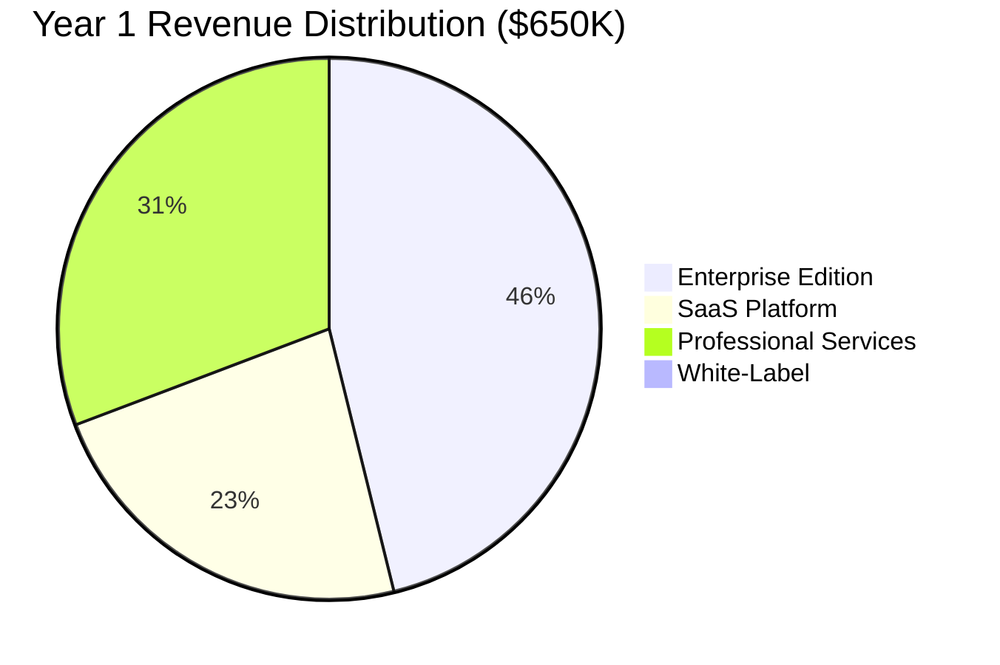
```mermaid
pie title Year 1 Revenue Distribution ($650K)
    "Enterprise Edition" : 300
    "SaaS Platform" : 150
    "Professional Services" : 200
    "White-Label" : 0
```

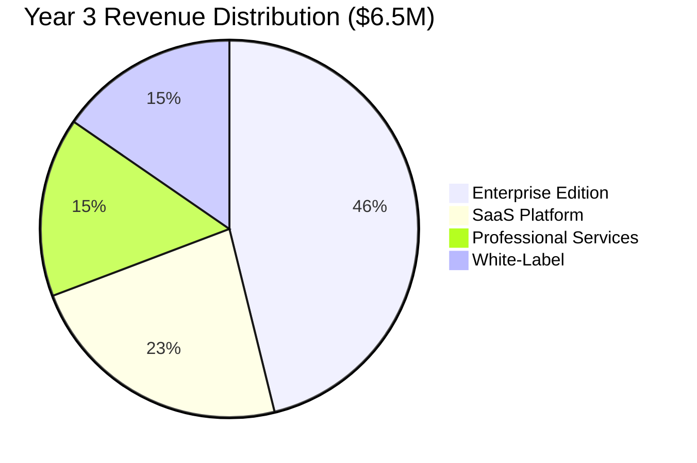
```mermaid
pie title Year 3 Revenue Distribution ($6.5M)
    "Enterprise Edition" : 3000
    "SaaS Platform" : 1500
    "Professional Services" : 1000
    "White-Label" : 1000
```

### 1.3 Customer Journey Map

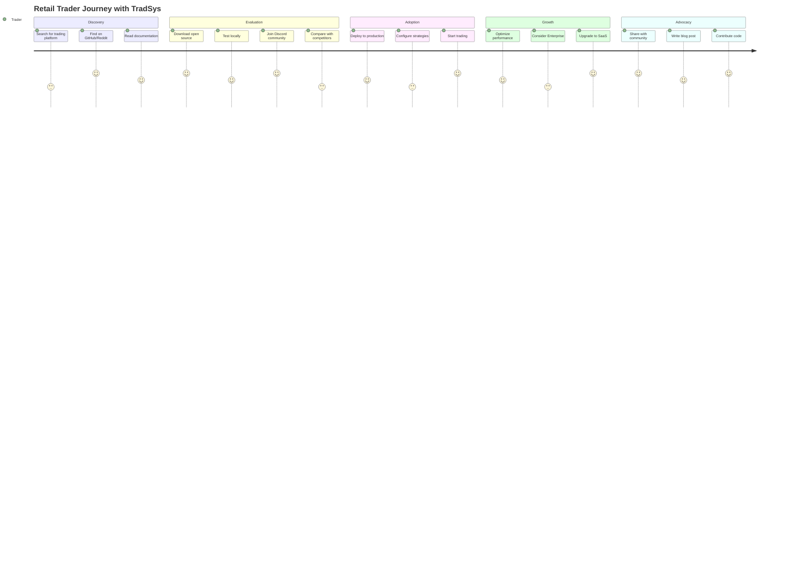
```mermaid
journey
    title Retail Trader Journey with TradSys
    section Discovery
      Search for trading platform: 3: Trader
      Find on GitHub/Reddit: 5: Trader
      Read documentation: 4: Trader
    section Evaluation
      Download open source: 5: Trader
      Test locally: 4: Trader
      Join Discord community: 5: Trader
      Compare with competitors: 3: Trader
    section Adoption
      Deploy to production: 4: Trader
      Configure strategies: 3: Trader
      Start trading: 5: Trader
    section Growth
      Optimize performance: 4: Trader
      Consider Enterprise: 3: Trader
      Upgrade to SaaS: 5: Trader
    section Advocacy
      Share with community: 5: Trader
      Write blog post: 4: Trader
      Contribute code: 5: Trader
```

### 1.4 Market Segmentation

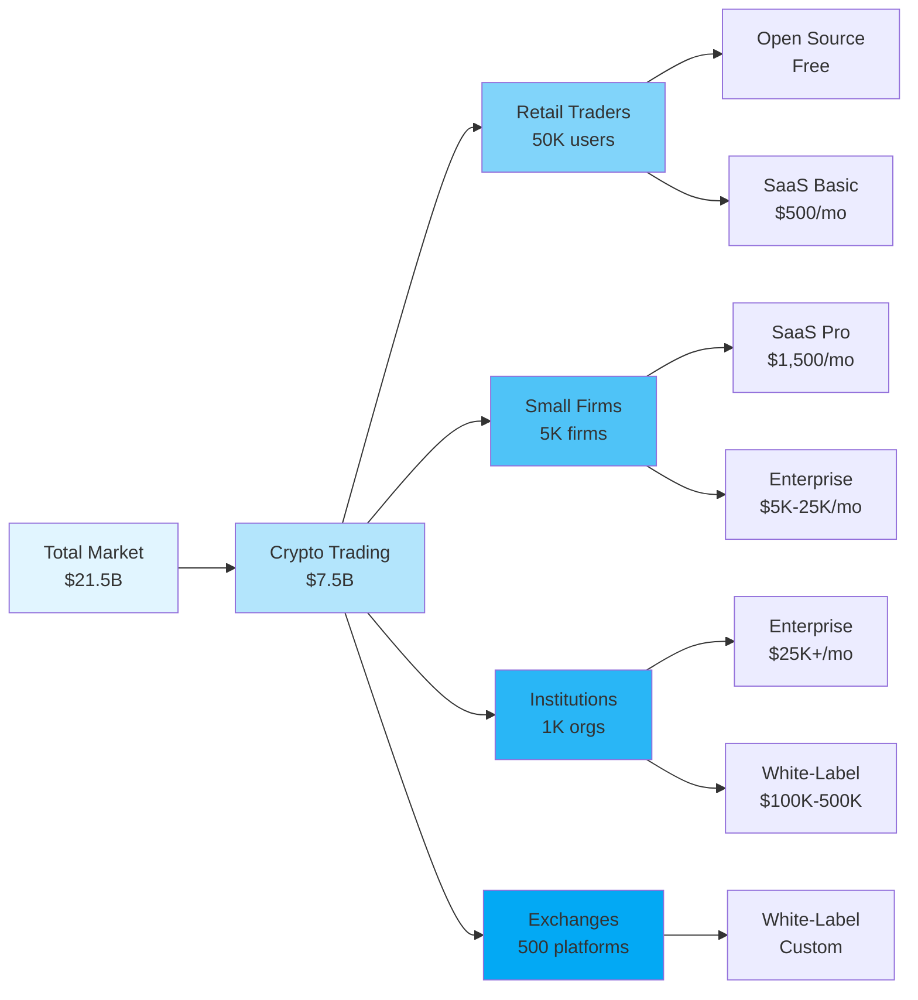
```mermaid
graph LR
    A[Total Market<br/>$21.5B] --> B[Crypto Trading<br/>$7.5B]
    B --> C1[Retail Traders<br/>50K users]
    B --> C2[Small Firms<br/>5K firms]
    B --> C3[Institutions<br/>1K orgs]
    B --> C4[Exchanges<br/>500 platforms]
    
    C1 --> D1[Open Source<br/>Free]
    C1 --> D2[SaaS Basic<br/>$500/mo]
    
    C2 --> E1[SaaS Pro<br/>$1,500/mo]
    C2 --> E2[Enterprise<br/>$5K-25K/mo]
    
    C3 --> F1[Enterprise<br/>$25K+/mo]
    C3 --> F2[White-Label<br/>$100K-500K]
    
    C4 --> G1[White-Label<br/>Custom]
    
    style A fill:#e1f5ff
    style B fill:#b3e5fc
    style C1 fill:#81d4fa
    style C2 fill:#4fc3f7
    style C3 fill:#29b6f6
    style C4 fill:#03a9f4
```

### 1.5 Go-to-Market Strategy Timeline

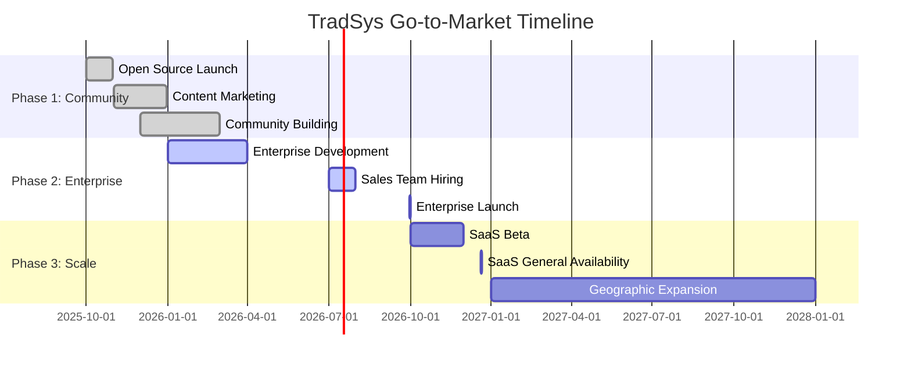
```mermaid
gantt
    title TradSys Go-to-Market Timeline
    dateFormat YYYY-MM-DD
    section Phase 1: Community
    Open Source Launch           :done, 2025-10-01, 30d
    Content Marketing           :done, 2025-11-01, 60d
    Community Building          :done, 2025-12-01, 90d
    
    section Phase 2: Enterprise
    Enterprise Development      :active, 2026-01-01, 90d
    Sales Team Hiring          :active, 2026-07-01, 30d
    Enterprise Launch          :2026-09-30, 1d
    
    section Phase 3: Scale
    SaaS Beta                  :2026-10-01, 60d
    SaaS General Availability  :2026-12-20, 1d
    Geographic Expansion       :2027-01-01, 365d
```

### 1.6 Competitive Positioning Matrix

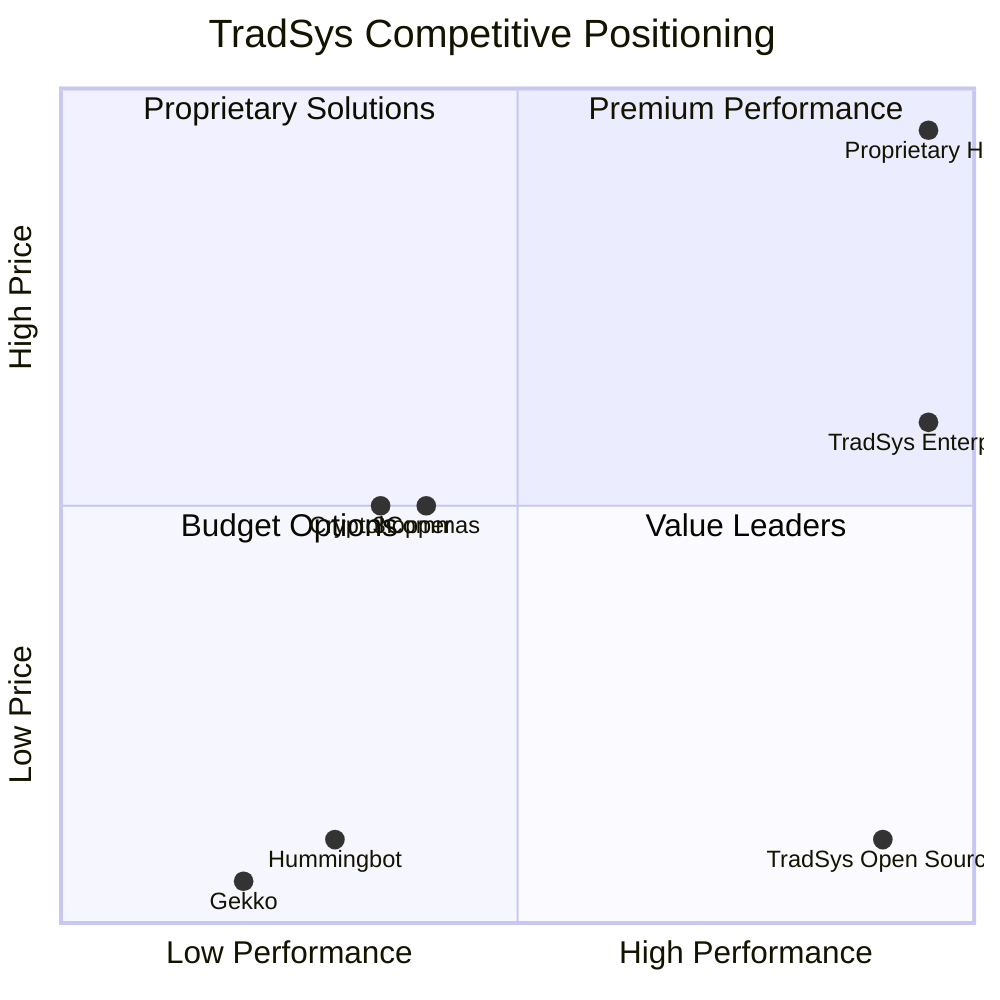
```mermaid
quadrantChart
    title TradSys Competitive Positioning
    x-axis Low Performance --> High Performance
    y-axis Low Price --> High Price
    quadrant-1 Premium Performance
    quadrant-2 Proprietary Solutions
    quadrant-3 Budget Options
    quadrant-4 Value Leaders
    TradSys Open Source: [0.9, 0.1]
    TradSys Enterprise: [0.95, 0.6]
    Hummingbot: [0.3, 0.1]
    3Commas: [0.4, 0.5]
    Cryptohopper: [0.35, 0.5]
    Proprietary HFT: [0.95, 0.95]
    Gekko: [0.2, 0.05]
```

---

## 🏗️ Software Architecture

### 2.1 High-Level System Architecture

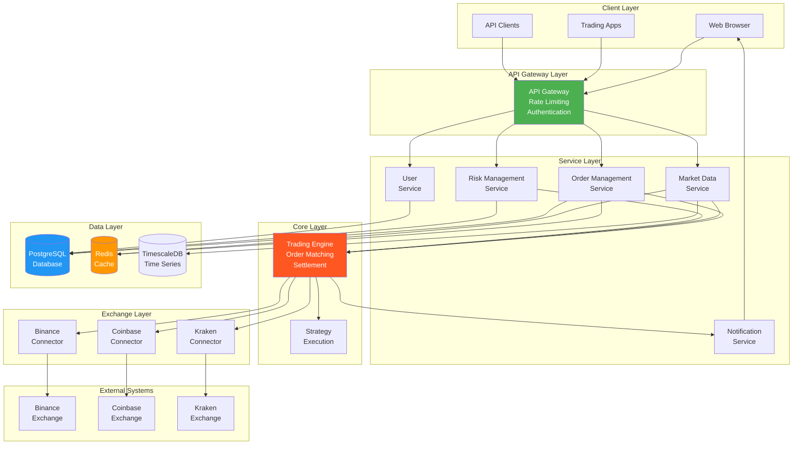
```mermaid
graph TB
    subgraph "Client Layer"
        WEB[Web Browser]
        APP[Trading Apps]
        API_CLIENT[API Clients]
    end
    
    subgraph "API Gateway Layer"
        GATEWAY[API Gateway<br/>Rate Limiting<br/>Authentication]
    end
    
    subgraph "Service Layer"
        ORDER[Order Management<br/>Service]
        MARKET[Market Data<br/>Service]
        RISK[Risk Management<br/>Service]
        USER[User<br/>Service]
        NOTIFY[Notification<br/>Service]
    end
    
    subgraph "Core Layer"
        ENGINE[Trading Engine<br/>Order Matching<br/>Settlement]
        STRATEGY[Strategy<br/>Execution]
    end
    
    subgraph "Exchange Layer"
        BINANCE[Binance<br/>Connector]
        COINBASE[Coinbase<br/>Connector]
        KRAKEN[Kraken<br/>Connector]
    end
    
    subgraph "Data Layer"
        DB[(PostgreSQL<br/>Database)]
        CACHE[(Redis<br/>Cache)]
        TS[(TimescaleDB<br/>Time Series)]
    end
    
    subgraph "External Systems"
        EX_BINANCE[Binance<br/>Exchange]
        EX_COINBASE[Coinbase<br/>Exchange]
        EX_KRAKEN[Kraken<br/>Exchange]
    end
    
    WEB --> GATEWAY
    APP --> GATEWAY
    API_CLIENT --> GATEWAY
    
    GATEWAY --> ORDER
    GATEWAY --> MARKET
    GATEWAY --> RISK
    GATEWAY --> USER
    
    ORDER --> ENGINE
    MARKET --> ENGINE
    RISK --> ENGINE
    
    ENGINE --> STRATEGY
    ENGINE --> BINANCE
    ENGINE --> COINBASE
    ENGINE --> KRAKEN
    
    BINANCE --> EX_BINANCE
    COINBASE --> EX_COINBASE
    KRAKEN --> EX_KRAKEN
    
    ORDER --> DB
    RISK --> DB
    USER --> DB
    MARKET --> TS
    
    ORDER --> CACHE
    MARKET --> CACHE
    
    ENGINE --> NOTIFY
    NOTIFY --> WEB
    
    style GATEWAY fill:#4CAF50,color:#fff
    style ENGINE fill:#FF5722,color:#fff
    style DB fill:#2196F3,color:#fff
    style CACHE fill:#FF9800,color:#fff
```

### 2.2 Microservices Architecture

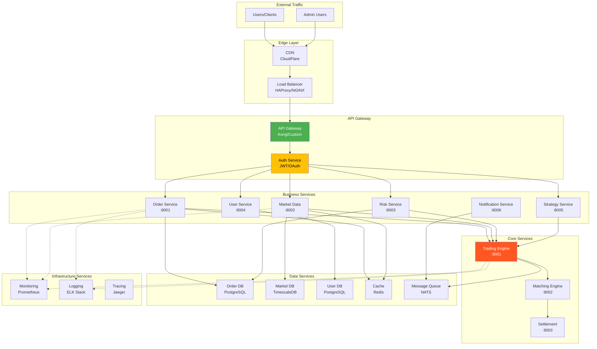
```mermaid
graph TB
    subgraph "External Traffic"
        USERS[Users/Clients]
        ADMIN[Admin Users]
    end
    
    subgraph "Edge Layer"
        LB[Load Balancer<br/>HAProxy/NGINX]
        CDN[CDN<br/>CloudFlare]
    end
    
    subgraph "API Gateway"
        APIGW[API Gateway<br/>Kong/Custom]
        AUTH[Auth Service<br/>JWT/OAuth]
    end
    
    subgraph "Business Services"
        MS1[Order Service<br/>:8001]
        MS2[Market Data<br/>:8002]
        MS3[Risk Service<br/>:8003]
        MS4[User Service<br/>:8004]
        MS5[Strategy Service<br/>:8005]
        MS6[Notification Service<br/>:8006]
    end
    
    subgraph "Core Services"
        CORE1[Trading Engine<br/>:9001]
        CORE2[Matching Engine<br/>:9002]
        CORE3[Settlement<br/>:9003]
    end
    
    subgraph "Data Services"
        DS1[Order DB<br/>PostgreSQL]
        DS2[Market DB<br/>TimescaleDB]
        DS3[User DB<br/>PostgreSQL]
        DS4[Cache<br/>Redis]
        DS5[Message Queue<br/>NATS]
    end
    
    subgraph "Infrastructure Services"
        INF1[Monitoring<br/>Prometheus]
        INF2[Logging<br/>ELK Stack]
        INF3[Tracing<br/>Jaeger]
    end
    
    USERS --> CDN
    ADMIN --> CDN
    CDN --> LB
    LB --> APIGW
    
    APIGW --> AUTH
    AUTH --> MS1
    AUTH --> MS2
    AUTH --> MS3
    AUTH --> MS4
    AUTH --> MS5
    
    MS1 --> CORE1
    MS2 --> CORE1
    MS3 --> CORE1
    MS5 --> CORE1
    
    CORE1 --> CORE2
    CORE2 --> CORE3
    
    MS1 --> DS1
    MS2 --> DS2
    MS3 --> DS1
    MS4 --> DS3
    
    MS1 --> DS4
    MS2 --> DS4
    
    CORE1 --> DS5
    MS6 --> DS5
    
    MS1 -.-> INF1
    MS2 -.-> INF1
    CORE1 -.-> INF1
    
    MS1 -.-> INF2
    CORE1 -.-> INF2
    
    style APIGW fill:#4CAF50,color:#fff
    style CORE1 fill:#FF5722,color:#fff
    style AUTH fill:#FFC107,color:#000
```

### 2.3 Order Processing Flow

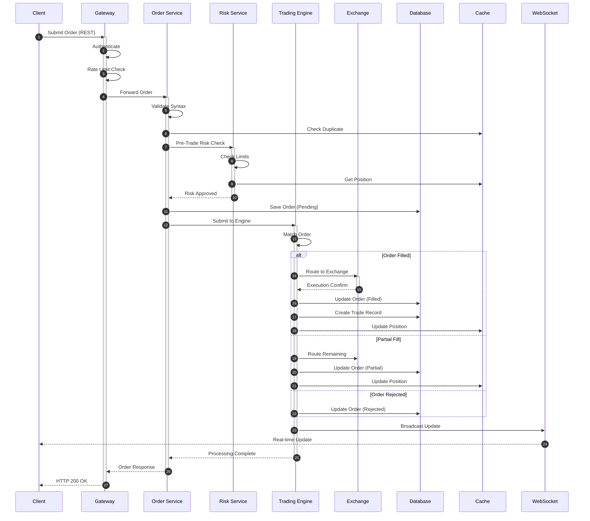
```mermaid
sequenceDiagram
    autonumber
    participant Client
    participant Gateway
    participant OrderSvc as Order Service
    participant RiskSvc as Risk Service
    participant Engine as Trading Engine
    participant Exchange
    participant DB as Database
    participant Cache
    participant WS as WebSocket
    
    Client->>Gateway: Submit Order (REST)
    activate Gateway
    Gateway->>Gateway: Authenticate
    Gateway->>Gateway: Rate Limit Check
    Gateway->>OrderSvc: Forward Order
    activate OrderSvc
    
    OrderSvc->>OrderSvc: Validate Syntax
    OrderSvc->>Cache: Check Duplicate
    OrderSvc->>RiskSvc: Pre-Trade Risk Check
    activate RiskSvc
    RiskSvc->>RiskSvc: Check Limits
    RiskSvc->>Cache: Get Position
    RiskSvc-->>OrderSvc: Risk Approved
    deactivate RiskSvc
    
    OrderSvc->>DB: Save Order (Pending)
    OrderSvc->>Engine: Submit to Engine
    activate Engine
    
    Engine->>Engine: Match Order
    alt Order Filled
        Engine->>Exchange: Route to Exchange
        activate Exchange
        Exchange-->>Engine: Execution Confirm
        deactivate Exchange
        Engine->>DB: Update Order (Filled)
        Engine->>DB: Create Trade Record
        Engine->>Cache: Update Position
    else Partial Fill
        Engine->>Exchange: Route Remaining
        Engine->>DB: Update Order (Partial)
        Engine->>Cache: Update Position
    else Order Rejected
        Engine->>DB: Update Order (Rejected)
    end
    
    Engine->>WS: Broadcast Update
    WS-->>Client: Real-time Update
    
    Engine-->>OrderSvc: Processing Complete
    deactivate Engine
    OrderSvc-->>Gateway: Order Response
    deactivate OrderSvc
    Gateway-->>Client: HTTP 200 OK
    deactivate Gateway
```

### 2.4 Market Data Flow

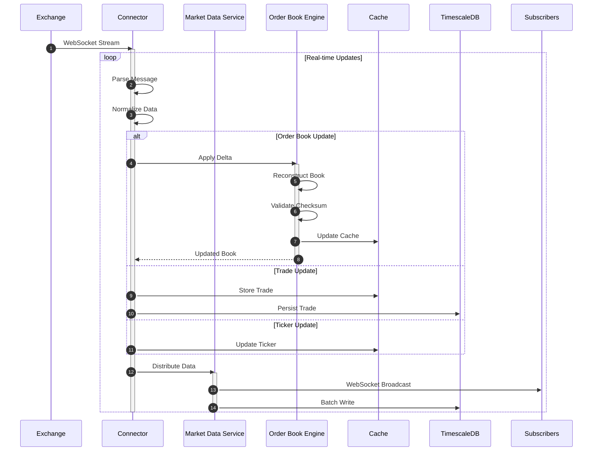
```mermaid
sequenceDiagram
    autonumber
    participant Exchange
    participant Connector
    participant MarketData as Market Data Service
    participant OrderBook as Order Book Engine
    participant Cache
    participant DB as TimescaleDB
    participant Subscribers
    
    Exchange->>Connector: WebSocket Stream
    activate Connector
    
    loop Real-time Updates
        Connector->>Connector: Parse Message
        Connector->>Connector: Normalize Data
        
        alt Order Book Update
            Connector->>OrderBook: Apply Delta
            activate OrderBook
            OrderBook->>OrderBook: Reconstruct Book
            OrderBook->>OrderBook: Validate Checksum
            OrderBook->>Cache: Update Cache
            OrderBook-->>Connector: Updated Book
            deactivate OrderBook
        else Trade Update
            Connector->>Cache: Store Trade
            Connector->>DB: Persist Trade
        else Ticker Update
            Connector->>Cache: Update Ticker
        end
        
        Connector->>MarketData: Distribute Data
        activate MarketData
        MarketData->>Subscribers: WebSocket Broadcast
        MarketData->>DB: Batch Write
        deactivate MarketData
    end
    
    deactivate Connector
```

### 2.5 Risk Management Flow

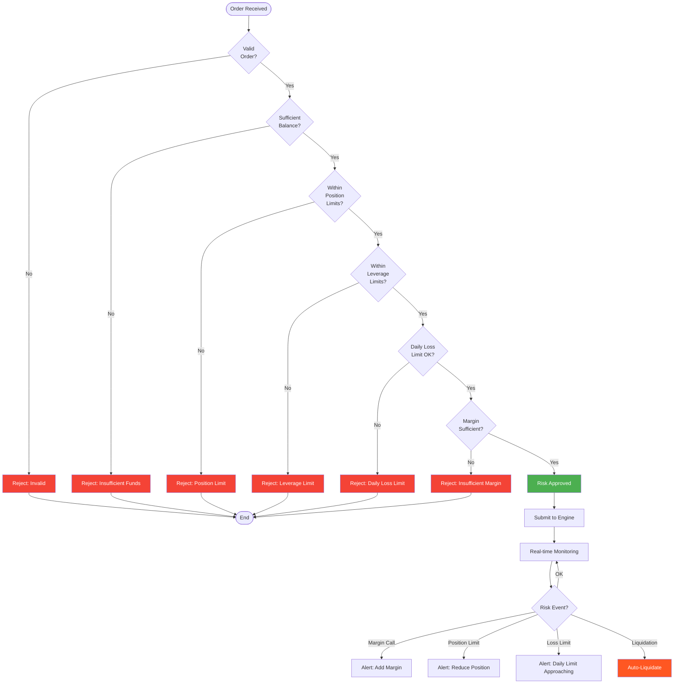
```mermaid
flowchart TD
    START([Order Received]) --> VALIDATE{Valid<br/>Order?}
    
    VALIDATE -->|No| REJECT1[Reject: Invalid]
    VALIDATE -->|Yes| BALANCE{Sufficient<br/>Balance?}
    
    BALANCE -->|No| REJECT2[Reject: Insufficient Funds]
    BALANCE -->|Yes| POSITION{Within<br/>Position<br/>Limits?}
    
    POSITION -->|No| REJECT3[Reject: Position Limit]
    POSITION -->|Yes| LEVERAGE{Within<br/>Leverage<br/>Limits?}
    
    LEVERAGE -->|No| REJECT4[Reject: Leverage Limit]
    LEVERAGE -->|Yes| DAILY{Daily Loss<br/>Limit OK?}
    
    DAILY -->|No| REJECT5[Reject: Daily Loss Limit]
    DAILY -->|Yes| MARGIN{Margin<br/>Sufficient?}
    
    MARGIN -->|No| REJECT6[Reject: Insufficient Margin]
    MARGIN -->|Yes| APPROVED[Risk Approved]
    
    APPROVED --> SUBMIT[Submit to Engine]
    SUBMIT --> MONITOR[Real-time Monitoring]
    
    MONITOR --> CHECK{Risk Event?}
    CHECK -->|Margin Call| ALERT1[Alert: Add Margin]
    CHECK -->|Position Limit| ALERT2[Alert: Reduce Position]
    CHECK -->|Loss Limit| ALERT3[Alert: Daily Limit Approaching]
    CHECK -->|Liquidation| ACTION[Auto-Liquidate]
    CHECK -->|OK| MONITOR
    
    REJECT1 --> END([End])
    REJECT2 --> END
    REJECT3 --> END
    REJECT4 --> END
    REJECT5 --> END
    REJECT6 --> END
    
    style APPROVED fill:#4CAF50,color:#fff
    style REJECT1 fill:#F44336,color:#fff
    style REJECT2 fill:#F44336,color:#fff
    style REJECT3 fill:#F44336,color:#fff
    style REJECT4 fill:#F44336,color:#fff
    style REJECT5 fill:#F44336,color:#fff
    style REJECT6 fill:#F44336,color:#fff
    style ACTION fill:#FF5722,color:#fff
```

### 2.6 Component Architecture

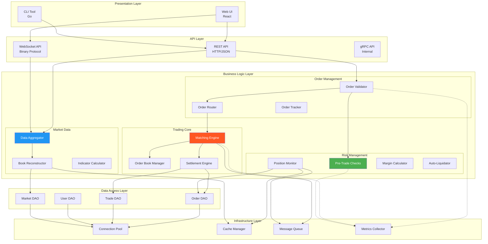
```mermaid
graph TB
    subgraph "Presentation Layer"
        UI[Web UI<br/>React]
        CLI[CLI Tool<br/>Go]
    end
    
    subgraph "API Layer"
        REST[REST API<br/>HTTP/JSON]
        WS[WebSocket API<br/>Binary Protocol]
        GRPC[gRPC API<br/>Internal]
    end
    
    subgraph "Business Logic Layer"
        subgraph "Order Management"
            OM1[Order Validator]
            OM2[Order Router]
            OM3[Order Tracker]
        end
        
        subgraph "Trading Core"
            TC1[Matching Engine]
            TC2[Order Book Manager]
            TC3[Settlement Engine]
        end
        
        subgraph "Risk Management"
            RM1[Pre-Trade Checks]
            RM2[Position Monitor]
            RM3[Margin Calculator]
            RM4[Auto-Liquidator]
        end
        
        subgraph "Market Data"
            MD1[Data Aggregator]
            MD2[Book Reconstructor]
            MD3[Indicator Calculator]
        end
    end
    
    subgraph "Data Access Layer"
        DAO1[Order DAO]
        DAO2[Trade DAO]
        DAO3[User DAO]
        DAO4[Market DAO]
    end
    
    subgraph "Infrastructure Layer"
        POOL[Connection Pool]
        CACHE_MGR[Cache Manager]
        QUEUE[Message Queue]
        METRICS[Metrics Collector]
    end
    
    UI --> REST
    CLI --> REST
    UI --> WS
    
    REST --> OM1
    REST --> MD1
    WS --> MD1
    
    OM1 --> RM1
    OM1 --> OM2
    OM2 --> TC1
    
    TC1 --> TC2
    TC1 --> TC3
    
    TC3 --> DAO1
    TC3 --> DAO2
    
    RM2 --> DAO1
    RM2 --> CACHE_MGR
    
    MD1 --> MD2
    MD2 --> DAO4
    MD2 --> CACHE_MGR
    
    DAO1 --> POOL
    DAO2 --> POOL
    DAO3 --> POOL
    DAO4 --> POOL
    
    TC1 --> QUEUE
    RM2 --> QUEUE
    
    OM1 -.-> METRICS
    TC1 -.-> METRICS
    RM1 -.-> METRICS
    
    style TC1 fill:#FF5722,color:#fff
    style RM1 fill:#4CAF50,color:#fff
    style MD1 fill:#2196F3,color:#fff
```

---

## 🏛️ System Architecture

### 3.1 Overall System Context

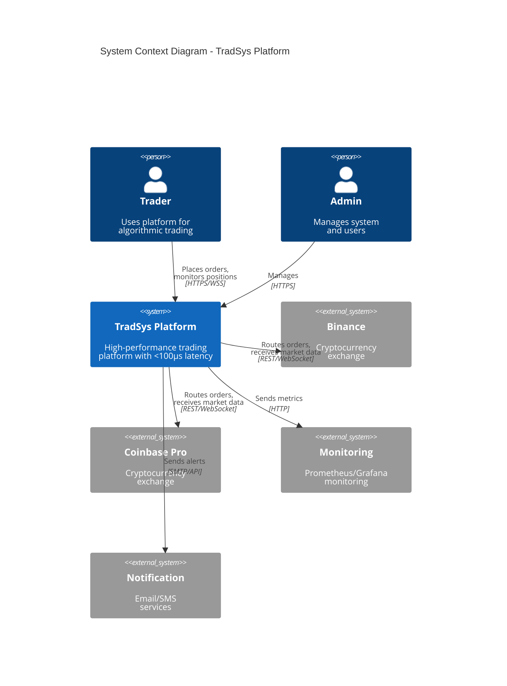
```mermaid
C4Context
    title System Context Diagram - TradSys Platform
    
    Person(trader, "Trader", "Uses platform for<br/>algorithmic trading")
    Person(admin, "Admin", "Manages system<br/>and users")
    
    System(tradsys, "TradSys Platform", "High-performance trading<br/>platform with <100μs latency")
    
    System_Ext(binance, "Binance", "Cryptocurrency<br/>exchange")
    System_Ext(coinbase, "Coinbase Pro", "Cryptocurrency<br/>exchange")
    System_Ext(monitoring, "Monitoring", "Prometheus/Grafana<br/>monitoring")
    System_Ext(notification, "Notification", "Email/SMS<br/>services")
    
    Rel(trader, tradsys, "Places orders,<br/>monitors positions", "HTTPS/WSS")
    Rel(admin, tradsys, "Manages", "HTTPS")
    Rel(tradsys, binance, "Routes orders,<br/>receives market data", "REST/WebSocket")
    Rel(tradsys, coinbase, "Routes orders,<br/>receives market data", "REST/WebSocket")
    Rel(tradsys, monitoring, "Sends metrics", "HTTP")
    Rel(tradsys, notification, "Sends alerts", "SMTP/API")
```

### 3.2 Container Diagram

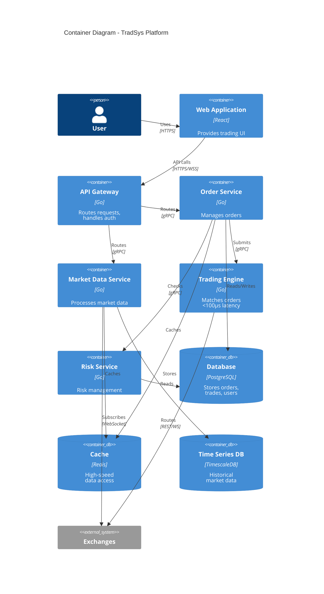
```mermaid
C4Container
    title Container Diagram - TradSys Platform
    
    Person(user, "User")
    
    Container(webapp, "Web Application", "React", "Provides trading UI")
    Container(api, "API Gateway", "Go", "Routes requests,<br/>handles auth")
    Container(order, "Order Service", "Go", "Manages orders")
    Container(market, "Market Data Service", "Go", "Processes market data")
    Container(engine, "Trading Engine", "Go", "Matches orders<br/><100μs latency")
    Container(risk, "Risk Service", "Go", "Risk management")
    
    ContainerDb(db, "Database", "PostgreSQL", "Stores orders,<br/>trades, users")
    ContainerDb(cache, "Cache", "Redis", "High-speed<br/>data access")
    ContainerDb(tsdb, "Time Series DB", "TimescaleDB", "Historical<br/>market data")
    
    System_Ext(exchange, "Exchanges")
    
    Rel(user, webapp, "Uses", "HTTPS")
    Rel(webapp, api, "API calls", "HTTPS/WSS")
    Rel(api, order, "Routes", "gRPC")
    Rel(api, market, "Routes", "gRPC")
    Rel(order, engine, "Submits", "gRPC")
    Rel(order, risk, "Checks", "gRPC")
    Rel(engine, exchange, "Routes", "REST/WS")
    Rel(market, exchange, "Subscribes", "WebSocket")
    
    Rel(order, db, "Reads/Writes")
    Rel(risk, db, "Reads")
    Rel(order, cache, "Caches")
    Rel(market, cache, "Caches")
    Rel(market, tsdb, "Stores")
```

### 3.3 Deployment Architecture (Single Region)

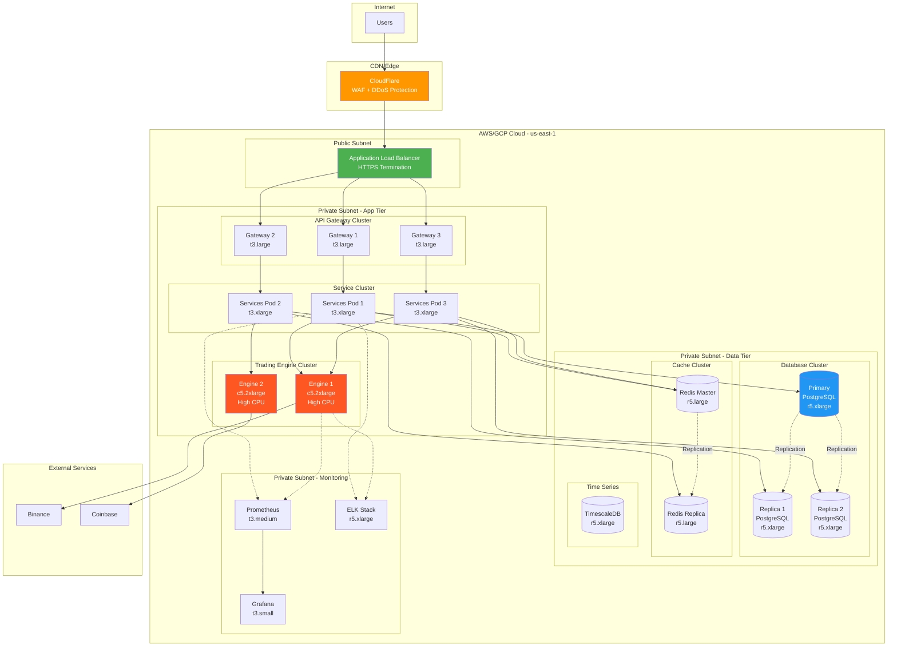
```mermaid
graph TB
    subgraph "Internet"
        USERS[Users]
    end
    
    subgraph "CDN/Edge"
        CF[CloudFlare<br/>WAF + DDoS Protection]
    end
    
    subgraph "AWS/GCP Cloud - us-east-1"
        subgraph "Public Subnet"
            ALB[Application Load Balancer<br/>HTTPS Termination]
        end
        
        subgraph "Private Subnet - App Tier"
            subgraph "API Gateway Cluster"
                GW1[Gateway 1<br/>t3.large]
                GW2[Gateway 2<br/>t3.large]
                GW3[Gateway 3<br/>t3.large]
            end
            
            subgraph "Service Cluster"
                SVC1[Services Pod 1<br/>t3.xlarge]
                SVC2[Services Pod 2<br/>t3.xlarge]
                SVC3[Services Pod 3<br/>t3.xlarge]
            end
            
            subgraph "Trading Engine Cluster"
                ENG1[Engine 1<br/>c5.2xlarge<br/>High CPU]
                ENG2[Engine 2<br/>c5.2xlarge<br/>High CPU]
            end
        end
        
        subgraph "Private Subnet - Data Tier"
            subgraph "Database Cluster"
                DB_MASTER[(Primary<br/>PostgreSQL<br/>r5.xlarge)]
                DB_REPLICA1[(Replica 1<br/>PostgreSQL<br/>r5.xlarge)]
                DB_REPLICA2[(Replica 2<br/>PostgreSQL<br/>r5.xlarge)]
            end
            
            subgraph "Cache Cluster"
                REDIS1[(Redis Master<br/>r5.large)]
                REDIS2[(Redis Replica<br/>r5.large)]
            end
            
            subgraph "Time Series"
                TS1[(TimescaleDB<br/>r5.xlarge)]
            end
        end
        
        subgraph "Private Subnet - Monitoring"
            PROM[Prometheus<br/>t3.medium]
            GRAF[Grafana<br/>t3.small]
            ELK[ELK Stack<br/>r5.xlarge]
        end
    end
    
    subgraph "External Services"
        EX1[Binance]
        EX2[Coinbase]
    end
    
    USERS --> CF
    CF --> ALB
    
    ALB --> GW1
    ALB --> GW2
    ALB --> GW3
    
    GW1 --> SVC1
    GW2 --> SVC2
    GW3 --> SVC3
    
    SVC1 --> ENG1
    SVC2 --> ENG2
    SVC3 --> ENG1
    
    ENG1 --> EX1
    ENG2 --> EX2
    
    SVC1 --> DB_MASTER
    SVC2 --> DB_REPLICA1
    SVC3 --> DB_REPLICA2
    
    SVC1 --> REDIS1
    SVC2 --> REDIS2
    SVC3 --> REDIS1
    
    DB_MASTER -.->|Replication| DB_REPLICA1
    DB_MASTER -.->|Replication| DB_REPLICA2
    REDIS1 -.->|Replication| REDIS2
    
    SVC1 -.-> PROM
    ENG1 -.-> PROM
    PROM --> GRAF
    
    SVC1 -.-> ELK
    ENG1 -.-> ELK
    
    style CF fill:#FF9800,color:#fff
    style ALB fill:#4CAF50,color:#fff
    style ENG1 fill:#FF5722,color:#fff
    style ENG2 fill:#FF5722,color:#fff
    style DB_MASTER fill:#2196F3,color:#fff
```

### 3.4 Multi-Region Architecture

```mermaid
graph TB
    subgraph "Global"
        DNS[Route53/CloudDNS<br/>Global DNS]
        CDN[CloudFlare CDN]
    end
    
    subgraph "US-EAST Region"
        subgraph "US Production"
            US_LB[Load Balancer]
            US_APP[Application Tier<br/>6 instances]
            US_DB[(Database<br/>Master)]
            US_CACHE[(Redis Cluster)]
        end
    end
    
    subgraph "EU-WEST Region"
        subgraph "EU Production"
            EU_LB[Load Balancer]
            EU_APP[Application Tier<br/>4 instances]
            EU_DB[(Database<br/>Master)]
            EU_CACHE[(Redis Cluster)]
        end
    end
    
    subgraph "AP-SOUTH Region"
        subgraph "Asia Production"
            AP_LB[Load Balancer]
            AP_APP[Application Tier<br/>4 instances]
            AP_DB[(Database<br/>Read Replica)]
            AP_CACHE[(Redis Cluster)]
        end
    end
    
    subgraph "Data Synchronization"
        SYNC[Cross-Region<br/>Replication<br/>Kafka/CDC]
    end
    
    DNS --> CDN
    CDN --> US_LB
    CDN --> EU_LB
    CDN --> AP_LB
    
    US_LB --> US_APP
    EU_LB --> EU_APP
    AP_LB --> AP_APP
    
    US_APP --> US_DB
    US_APP --> US_CACHE
    
    EU_APP --> EU_DB
    EU_APP --> EU_CACHE
    
    AP_APP --> AP_DB
    AP_APP --> AP_CACHE
    
    US_DB -.->|Async Replication| SYNC
    EU_DB -.->|Async Replication| SYNC
    SYNC -.->|Replication| AP_DB
    
    style DNS fill:#4CAF50,color:#fff
    style CDN fill:#FF9800,color:#fff
    style
