# 📊 TradSys v3 - Intelligent Multi-Exchange Trading Platform Diagrams

**Version:** 2.0  
**Date:** October 24, 2024  
**Status:** COMPREHENSIVE - All 6 Strategic Plans Integrated  

This document contains comprehensive system diagrams for **TradSys v3**, illustrating the intelligent multi-exchange trading platform architecture with real-time WebSocket communication, Islamic finance support, and enterprise licensing across all 6 strategic plans.

---

## 🏗️ **TradSys v3 Strategic Architecture Diagrams**

### **1. TradSys v3 - Complete System Architecture Overview**

```mermaid
graph TB
    subgraph "Frontend Layer - Plan 3: Dashboard Modernization"
        WEB[React/TypeScript Dashboard<br/>🌍 EGX/ADX Trading<br/>🕌 Islamic Finance UI<br/>📊 Real-time Updates]
        MOBILE[Mobile PWA<br/>📱 Offline Support<br/>🌐 Arabic/RTL UI<br/>🔔 Push Notifications]
        WS_CLIENTS[WebSocket Clients<br/>⚡ Live Subscriptions<br/>🔐 License Validation<br/>🕌 Compliance Filtering]
    end
    
    subgraph "WebSocket Gateway - Plan 6: Real-Time WebSocket System"
        WS_GATEWAY[Intelligent WebSocket Gateway<br/>🧠 Multi-dimensional Routing<br/>🌍 Exchange-specific Channels<br/>🔐 License-aware Subscriptions<br/>🕌 Islamic Finance Filtering]
        WS_CONN_MGR[Connection Manager<br/>📊 100K+ Concurrent Connections<br/>⚡ <10ms Connection Latency<br/>🔄 Auto-scaling]
        WS_SUB_MGR[Subscription Manager<br/>🎯 Real-time Validation<br/>📈 Usage Tracking<br/>🔐 Feature Access Control]
    end
    
    subgraph "Intelligent Routing Layer - Plan 5: Intelligent Routing"
        ROUTER[Multi-Dimensional Router<br/>🧠 Context-aware Decisions<br/>🌍 Exchange-specific Routing<br/>🔐 Licensing Validation<br/>🕌 Islamic Finance Compliance]
        LOAD_BAL[Intelligent Load Balancer<br/>⚖️ Latency-aware Distribution<br/>🏥 Health Checking<br/>📍 Regional Optimization]
        CIRCUIT_BREAKER[Circuit Breaker<br/>🔄 Fault Tolerance<br/>🚨 Auto-recovery<br/>📊 Error Monitoring]
    end
    
    subgraph "Service Mesh Layer - Plan 4: Services Architecture"
        SERVICE_MESH[Unified Service Mesh<br/>🔒 mTLS Security<br/>🔍 Service Discovery<br/>📊 Distributed Tracing<br/>⚡ Performance Monitoring]
        
        subgraph "Core Services"
            LICENSING_SVC[Enterprise Licensing Service<br/>🔐 Multi-tier Validation<br/>💰 Usage-based Billing<br/>📊 Real-time Quotas<br/>📋 Audit Trails]
            ISLAMIC_SVC[Islamic Finance Service<br/>🕌 Sharia Compliance<br/>✅ Halal Screening<br/>📊 Multiple Boards<br/>💰 Zakat Calculation]
            WEBSOCKET_SVC[WebSocket Service<br/>🌐 Connection Management<br/>📡 Message Routing<br/>🔐 Subscription Validation<br/>🕌 Compliance Filtering]
        end
        
        subgraph "Exchange Services"
            EGX_SVC[EGX Service<br/>🇪🇬 Egyptian Exchange<br/>🏛️ Cairo Optimization<br/>📊 Multi-asset Support<br/>🕌 Islamic Instruments]
            ADX_SVC[ADX Service<br/>🇦🇪 Abu Dhabi Exchange<br/>🏛️ UAE Optimization<br/>📊 Multi-asset Support<br/>🕌 Sharia Focus]
        end
        
        subgraph "Asset Services"
            ASSET_CORE[Core Asset Service<br/>📊 8 Asset Classes<br/>🔄 Type-safe Operations<br/>📈 Performance Analytics]
            SUKUK_SVC[Sukuk Service<br/>🕌 Islamic Bonds<br/>✅ Sharia Compliance<br/>📊 Yield Calculations]
            ISLAMIC_FUND_SVC[Islamic Fund Service<br/>🕌 Halal Investments<br/>📊 NAV Operations<br/>✅ Screening]
        end
    end
    
    subgraph "Exchange Integration Layer - Plan 1: Middle East Exchanges"
        EGX_CONNECTOR[EGX Connector<br/>🇪🇬 Egyptian Exchange Integration<br/>🏛️ Cairo Region Optimization<br/>📊 Egyptian Compliance<br/>🌐 Arabic Language Support]
        ADX_CONNECTOR[ADX Connector<br/>🇦🇪 Abu Dhabi Exchange Integration<br/>🏛️ UAE Region Optimization<br/>📊 UAE Compliance<br/>🕌 Islamic Finance Focus]
        PLUGIN_SYSTEM[Plugin System<br/>🔌 Extensible Architecture<br/>➕ Easy Exchange Addition<br/>🔧 Custom Protocols<br/>📊 Market Adapters]
    end
    
    subgraph "Data & Storage Layer"
        MARKET_DATA[(Market Data Store<br/>📊 Real-time Data<br/>📈 Historical Data<br/>📋 Order Books<br/>💼 Trade Records)]
        ANALYTICS[(Analytics Engine<br/>📊 Performance Analytics<br/>⚠️ Risk Calculations<br/>📈 Portfolio Optimization<br/>📋 Regulatory Reporting)]
        SEARCH[(Search Engine<br/>🔍 Asset Search<br/>✅ Compliance Search<br/>🕌 Islamic Screening<br/>🌐 Multi-language)]
    end
    
    %% Frontend to WebSocket Gateway
    WEB --> WS_GATEWAY
    MOBILE --> WS_GATEWAY
    WS_CLIENTS --> WS_GATEWAY
    
    %% WebSocket Gateway Internal
    WS_GATEWAY --> WS_CONN_MGR
    WS_GATEWAY --> WS_SUB_MGR
    
    %% WebSocket to Routing
    WS_GATEWAY --> ROUTER
    WS_CONN_MGR --> LOAD_BAL
    WS_SUB_MGR --> CIRCUIT_BREAKER
    
    %% Routing to Service Mesh
    ROUTER --> SERVICE_MESH
    LOAD_BAL --> LICENSING_SVC
    LOAD_BAL --> ISLAMIC_SVC
    LOAD_BAL --> WEBSOCKET_SVC
    CIRCUIT_BREAKER --> EGX_SVC
    CIRCUIT_BREAKER --> ADX_SVC
    
    %% Service Mesh Internal
    SERVICE_MESH --> LICENSING_SVC
    SERVICE_MESH --> ISLAMIC_SVC
    SERVICE_MESH --> WEBSOCKET_SVC
    SERVICE_MESH --> EGX_SVC
    SERVICE_MESH --> ADX_SVC
    SERVICE_MESH --> ASSET_CORE
    SERVICE_MESH --> SUKUK_SVC
    SERVICE_MESH --> ISLAMIC_FUND_SVC
    
    %% Services to Exchange Integration
    EGX_SVC --> EGX_CONNECTOR
    ADX_SVC --> ADX_CONNECTOR
    ASSET_CORE --> PLUGIN_SYSTEM
    
    %% Services to Data Layer
    LICENSING_SVC --> ANALYTICS
    ISLAMIC_SVC --> SEARCH
    WEBSOCKET_SVC --> MARKET_DATA
    EGX_SVC --> MARKET_DATA
    ADX_SVC --> MARKET_DATA
    ASSET_CORE --> ANALYTICS
    SUKUK_SVC --> SEARCH
    ISLAMIC_FUND_SVC --> SEARCH
    
    %% Styling
    style WEB fill:#4ECDC4,color:#fff
    style WS_GATEWAY fill:#FF6B6B,color:#fff
    style ROUTER fill:#45B7D1,color:#fff
    style SERVICE_MESH fill:#96CEB4,color:#fff
    style LICENSING_SVC fill:#FECA57,color:#fff
    style ISLAMIC_SVC fill:#FF9FF3,color:#fff
    style EGX_SVC fill:#FF6B6B,color:#fff
    style ADX_SVC fill:#4ECDC4,color:#fff
    style EGX_CONNECTOR fill:#FF6B6B,color:#fff
    style ADX_CONNECTOR fill:#4ECDC4,color:#fff
```



### **2. WebSocket System Architecture - Plan 6**

```mermaid
graph TB
    subgraph "Client Connections"
        DASHBOARD[Dashboard Client<br/>🌐 React/TypeScript<br/>📊 Real-time Trading<br/>🕌 Islamic Finance UI]
        MOBILE[Mobile Client<br/>📱 PWA Application<br/>🌐 Arabic/RTL Support<br/>🔔 Push Notifications]
        API[API Client<br/>🔌 REST/GraphQL<br/>📊 Programmatic Access<br/>🔐 Authentication]
    end
    
    subgraph "WebSocket Gateway Layer"
        WS_GATEWAY[WebSocket Gateway<br/>🌐 Intelligent Routing<br/>⚡ <10ms Connection Latency<br/>📊 100K+ Concurrent Connections]
        CONN_MGR[Connection Manager<br/>🔗 Connection Lifecycle<br/>💓 Heartbeat Monitoring<br/>🔄 Auto-reconnection]
        SUB_MGR[Subscription Manager<br/>🎯 Real-time Subscriptions<br/>🔐 License Validation<br/>📊 Usage Tracking]
    end
    
    subgraph "Exchange-Specific Channels"
        EGX_CHANNEL[EGX WebSocket Channel<br/>🇪🇬 Egyptian Exchange<br/>📊 Market Data Stream<br/>📋 Order Book Updates<br/>💼 Trade Execution]
        ADX_CHANNEL[ADX WebSocket Channel<br/>🇦🇪 Abu Dhabi Exchange<br/>🕌 Islamic Data Stream<br/>💰 Sukuk Prices<br/>✅ Halal Stock Updates]
        UNIFIED_CHANNEL[Unified Channel<br/>🔄 Cross-exchange Data<br/>📊 Portfolio Updates<br/>⚠️ Risk Alerts<br/>📈 Analytics Stream]
    end
    
    subgraph "Compliance & Licensing Layer"
        LICENSE_VALIDATOR[License Validator<br/>🔐 Real-time Validation<br/>📊 Quota Management<br/>🎯 Feature Access Control<br/>📋 Audit Logging]
        ISLAMIC_FILTER[Islamic Finance Filter<br/>🕌 Sharia Compliance<br/>✅ Halal Screening<br/>📊 Multiple Boards<br/>🚫 Haram Filtering]
        COMPLIANCE_ENGINE[Compliance Engine<br/>📋 Regulatory Compliance<br/>🇪🇬 Egyptian Rules<br/>🇦🇪 UAE Regulations<br/>📊 Reporting]
    end
    
    subgraph "Service Integration Layer"
        SERVICE_DISCOVERY[Service Discovery<br/>🔍 Dynamic Service Location<br/>⚖️ Load Balancing<br/>🏥 Health Checking<br/>📊 Performance Monitoring]
        MESSAGE_ROUTER[Message Router<br/>🧠 Intelligent Routing<br/>🎯 Context-aware Decisions<br/>📊 Performance Optimization<br/>🔄 Failover Handling]
        ANALYTICS_ENGINE[Analytics Engine<br/>📊 Real-time Analytics<br/>📈 Performance Metrics<br/>👥 User Behavior<br/>💰 Revenue Tracking]
    end
    
    subgraph "Data Sources"
        MARKET_DATA_SVC[Market Data Service<br/>📊 Real-time Prices<br/>📈 Historical Data<br/>📋 Order Books<br/>💼 Trade History]
        LICENSING_SVC[Licensing Service<br/>🔐 License Management<br/>💰 Billing Integration<br/>📊 Usage Analytics<br/>📋 Compliance Tracking]
        ISLAMIC_SVC[Islamic Finance Service<br/>🕌 Sharia Validation<br/>✅ Compliance Checking<br/>📊 Screening Results<br/>💰 Zakat Calculations]
    end
    
    %% Client to Gateway
    DASHBOARD --> WS_GATEWAY
    MOBILE --> WS_GATEWAY
    API --> WS_GATEWAY
    
    %% Gateway Internal
    WS_GATEWAY --> CONN_MGR
    WS_GATEWAY --> SUB_MGR
    
    %% Gateway to Channels
    CONN_MGR --> EGX_CHANNEL
    CONN_MGR --> ADX_CHANNEL
    CONN_MGR --> UNIFIED_CHANNEL
    
    %% Subscription Management
    SUB_MGR --> LICENSE_VALIDATOR
    SUB_MGR --> ISLAMIC_FILTER
    SUB_MGR --> COMPLIANCE_ENGINE
    
    %% Compliance to Channels
    LICENSE_VALIDATOR --> EGX_CHANNEL
    ISLAMIC_FILTER --> ADX_CHANNEL
    COMPLIANCE_ENGINE --> UNIFIED_CHANNEL
    
    %% Service Integration
    EGX_CHANNEL --> SERVICE_DISCOVERY
    ADX_CHANNEL --> MESSAGE_ROUTER
    UNIFIED_CHANNEL --> ANALYTICS_ENGINE
    
    %% Data Sources
    SERVICE_DISCOVERY --> MARKET_DATA_SVC
    MESSAGE_ROUTER --> LICENSING_SVC
    ANALYTICS_ENGINE --> ISLAMIC_SVC
    
    %% Styling
    style WS_GATEWAY fill:#FF6B6B,color:#fff
    style EGX_CHANNEL fill:#FF6B6B,color:#fff
    style ADX_CHANNEL fill:#4ECDC4,color:#fff
    style LICENSE_VALIDATOR fill:#FECA57,color:#fff
    style ISLAMIC_FILTER fill:#FF9FF3,color:#fff
    style SERVICE_DISCOVERY fill:#96CEB4,color:#fff
    style MESSAGE_ROUTER fill:#45B7D1,color:#fff
```



### **3. Intelligent Routing System Architecture - Plan 5**


---

## 🔄 **Data Flow Diagrams**

### **4. Multi-Exchange Order Processing Flow**

```mermaid
sequenceDiagram
    participant Client as 📱 Client (Dashboard/Mobile)
    participant WSGateway as 🌐 WebSocket Gateway
    participant Router as 🧠 Intelligent Router
    participant LicenseService as 🔐 License Service
    participant IslamicService as 🕌 Islamic Finance Service
    participant ExchangeService as 🏛️ Exchange Service (EGX/ADX)
    participant TradingEngine as ⚡ Trading Engine
    participant Database as 💾 Database
    
    Note over Client,Database: TradSys v3 - Multi-Exchange Order Processing
    
    Client->>WSGateway: 📡 Submit Order via WebSocket
    WSGateway->>WSGateway: 🔗 Validate Connection & Subscription
    WSGateway->>Router: 🧠 Route Order Request
    
    Router->>Router: 🎯 Analyze Context (User, Market, License)
    Router->>LicenseService: 🔐 Validate License & Quotas
    LicenseService->>Database: 📊 Check License Status & Usage
    Database-->>LicenseService: ✅ License Valid, Quota Available
    LicenseService-->>Router: ✅ License Validation Passed
    
    alt Islamic Finance Order
        Router->>IslamicService: 🕌 Validate Sharia Compliance
        IslamicService->>IslamicService: ✅ Check Halal Screening
        IslamicService->>Database: 📋 Get Compliance Rules
        Database-->>IslamicService: 📊 Sharia Board Rules
        IslamicService-->>Router: ✅ Sharia Compliant
    else Conventional Order
        Router->>Router: ⏭️ Skip Islamic Validation
    end
    
    Router->>ExchangeService: 🏛️ Route to Exchange (EGX/ADX)
    
    alt EGX Order
        ExchangeService->>ExchangeService: 🇪🇬 Apply EGX Rules & Validation
        ExchangeService->>Database: 📊 Get EGX Market Data
        Database-->>ExchangeService: 📈 Current EGX Prices & Limits
    else ADX Order
        ExchangeService->>ExchangeService: 🇦🇪 Apply ADX Rules & Validation
        ExchangeService->>Database: 📊 Get ADX Market Data
        Database-->>ExchangeService: 📈 Current ADX Prices & Limits
    end
    
    ExchangeService->>TradingEngine: ⚡ Submit Validated Order
    TradingEngine->>TradingEngine: ⚠️ Risk Assessment
    TradingEngine->>Database: 📊 Get Portfolio Positions
    Database-->>TradingEngine: 💼 Current Holdings
    
    alt Risk Approved
        TradingEngine->>TradingEngine: ✅ Execute Order
        TradingEngine->>Database: 💾 Update Order Status
        TradingEngine->>ExchangeService: ✅ Order Executed
        ExchangeService->>Router: ✅ Execution Confirmation
        Router->>WSGateway: 📡 Route Confirmation
        WSGateway->>Client: 🎉 Real-time Order Confirmation
        
        Note over WSGateway,Client: 📊 Real-time Updates via WebSocket
        WSGateway->>Client: 📈 Portfolio Update
        WSGateway->>Client: 💰 Balance Update
        WSGateway->>Client: 📊 Market Data Update
        
    else Risk Rejected
        TradingEngine->>ExchangeService: ❌ Risk Rejection
        ExchangeService->>Router: ❌ Order Rejected
        Router->>WSGateway: 📡 Route Rejection
        WSGateway->>Client: ⚠️ Real-time Order Rejection
    end
    
    Note over Client,Database: 📊 Usage Tracking & Billing
    LicenseService->>Database: 📊 Update Usage Metrics
    IslamicService->>Database: 📋 Log Compliance Check
    ExchangeService->>Database: 📈 Record Exchange Activity
```



### **4. Real-Time Market Data Flow**


---

## 🏦 **Asset-Specific Workflows**

### **5. REIT Analysis Workflow**


### **6. ETF Creation/Redemption Process**


### **7. Bond Yield Calculation Process**

```mermaid
flowchart TD
    START([Bond Analysis Request]) --> INPUT[Input Parameters<br/>Face Value, Coupon, Maturity, Price]
    
    INPUT --> VALIDATE{Validate Inputs}
    VALIDATE -->|Invalid| ERROR[Return Error]
    VALIDATE -->|Valid| CALC_CURRENT[Calculate Current Yield]
    
    CALC_CURRENT --> INIT_YTM[Initialize YTM Guess<br/>YTM = Coupon Rate]
    INIT_YTM --> NEWTON_RAPHSON[Newton-Raphson Iteration]
    
    NEWTON_RAPHSON --> CALC_PV[Calculate Present Value<br/>Using Current YTM]
    CALC_PV --> CALC_DERIVATIVE[Calculate PV Derivative]
    CALC_DERIVATIVE --> UPDATE_YTM[Update YTM Estimate]
    
    UPDATE_YTM --> CONVERGED{Converged?<br/>|New YTM - Old YTM| < 0.0001}
    CONVERGED -->|No| NEWTON_RAPHSON
    CONVERGED -->|Yes| CALC_DURATION[Calculate Duration]
    
    CALC_DURATION --> CALC_CONVEXITY[Calculate Convexity]
    CALC_CONVEXITY --> CALC_ACCRUED[Calculate Accrued Interest]
    CALC_ACCRUED --> ASSESS_CREDIT[Assess Credit Risk]
    
    ASSESS_CREDIT --> PROJECT_CF[Project Cash Flows]
    PROJECT_CF --> GENERATE_REPORT[Generate Bond Report]
    GENERATE_REPORT --> RETURN[Return Bond Metrics]
    
    style START fill:#FECA57,color:#fff
    style NEWTON_RAPHSON fill:#FF6B6B,color:#fff
    style RETURN fill:#96CEB4,color:#fff
    style ERROR fill:#FF6B6B,color:#fff
```

---

## 📊 **Database Schema Diagrams**

### **8. Multi-Asset Database Schema**


---

## 🚀 **Deployment Architecture**

### **9. Kubernetes Deployment Diagram**


---

## 📈 **Performance & Scaling Diagrams**

### **10. Auto-Scaling Architecture**


---

This comprehensive diagram collection provides visual documentation for all aspects of the TradSys Multi-Asset Trading System, from high-level architecture to detailed workflows and deployment strategies.
