# 📐 TradSys System Diagrams

<div align="center">


**Complete Visual Documentation of TradSys Platform**

---

[Business](#-business-architecture) • [Software](#-software-architecture) • [System](#-system-architecture) • [Infrastructure](#-infrastructure-architecture) • [Data](#-data-architecture) • [Security](#-security-architecture) • [Network](#-network-architecture)

---

</div>

## 📑 Table of Contents

1. [Business Architecture](#-business-architecture)
2. [Software Architecture](#-software-architecture)
3. [System Architecture](#-system-architecture)
4. [Infrastructure Architecture](#-infrastructure-architecture)
5. [Data Architecture](#-data-architecture)
6. [Security Architecture](#-security-architecture)
7. [Deployment Architecture](#-deployment-architecture)
8. [Network Architecture](#-network-architecture)

---

## 💼 Business Architecture

### 1.1 Business Model Canvas

```mermaid
graph TB
    subgraph KeyPartners["🤝 Key Partners"]
        A1["Exchanges<br/>Binance, Coinbase"]
        A2["Cloud Providers<br/>AWS, GCP, Azure"]
        A3["Technology Partners<br/>TradingView"]
    end
    
    subgraph KeyActivities["⚙️ Key Activities"]
        B1["Software Development"]
        B2["Customer Support"]
        B3["Marketing & Sales"]
    end
    
    subgraph ValuePropositions["💎 Value Propositions"]
        C1["Ultra-Low Latency<br/>< 100μs"]
        C2["Cost Effective<br/>Open Source Core"]
        C3["Multi-Exchange<br/>Support"]
    end
    
    subgraph CustomerSegments["👥 Customer Segments"]
        E1["Retail Traders"]
        E2["Trading Firms"]
        E3["Market Makers"]
        E4["Institutions"]
    end
    
    subgraph RevenueStreams["💰 Revenue Streams"]
        I1["Enterprise: 46%"]
        I2["SaaS: 23%"]
        I3["Services: 15%"]
        I4["White-Label: 16%"]
    end
    
    A1 --> B1
    B1 --> C1
    C1 --> E1
    C1 --> E2
    C2 --> E1
    C3 --> E2
    C3 --> E3
    E1 --> I2
    E2 --> I1
    E3 --> I1
    E4 --> I4
    
    style C1 fill:#4CAF50,color:#fff
    style E1 fill:#2196F3,color:#fff
    style I1 fill:#FF9800,color:#fff
```



### 1.2 Revenue Distribution

**Year 1 Revenue Breakdown ($650K)**


**Year 3 Revenue Projection ($6.5M)**


### 1.3 Customer Journey Map


### 1.4 Market Segmentation Flow


### 1.5 Go-to-Market Timeline


### 1.6 Competitive Positioning


---

## 🏗️ Software Architecture

### 2.1 High-Level System Architecture

```mermaid
graph TB
    subgraph ClientLayer["📱 Client Layer"]
        WEB["Web Browser"]
        APP["Trading Apps"]
        API_CLIENT["API Clients"]
    end
    
    subgraph GatewayLayer["🚪 API Gateway Layer"]
        GATEWAY["API Gateway<br/>Rate Limiting<br/>Authentication"]
    end
    
    subgraph ServiceLayer["⚙️ Service Layer"]
        ORDER["Order Management<br/>Service"]
        MARKET["Market Data<br/>Service"]
        RISK["Risk Management<br/>Service"]
        USER["User<br/>Service"]
    end
    
    subgraph CoreLayer["🔥 Core Layer"]
        ENGINE["Trading Engine<br/>Order Matching<br/>Settlement"]
        STRATEGY["Strategy<br/>Execution"]
    end
    
    subgraph ExchangeLayer["🔗 Exchange Layer"]
        BINANCE["Binance<br/>Connector"]
        COINBASE["Coinbase<br/>Connector"]
    end
    
    subgraph DataLayer["💾 Data Layer"]
        DB[("PostgreSQL<br/>Database")]
        CACHE[("Redis<br/>Cache")]
        TS[("TimescaleDB<br/>Time Series")]
    end
    
    WEB --> GATEWAY
    APP --> GATEWAY
    API_CLIENT --> GATEWAY
    
    GATEWAY --> ORDER
    GATEWAY --> MARKET
    GATEWAY --> RISK
    GATEWAY --> USER
    
    ORDER --> ENGINE
    MARKET --> ENGINE
    RISK --> ENGINE
    
    ENGINE --> STRATEGY
    ENGINE --> BINANCE
    ENGINE --> COINBASE
    
    ORDER --> DB
    RISK --> DB
    USER --> DB
    MARKET --> TS
    
    ORDER --> CACHE
    MARKET --> CACHE
    
    style GATEWAY fill:#4CAF50,color:#fff
    style ENGINE fill:#FF5722,color:#fff
    style DB fill:#2196F3,color:#fff
```



### 2.2 Microservices Architecture


### 2.3 Order Processing Sequence


### 2.4 Market Data Flow


### 2.5 Risk Management Flow

```mermaid
flowchart TD
    START(["Order Received"]) --> VALIDATE{"Valid<br/>Order?"}
    
    VALIDATE -->|No| REJECT1["❌ Reject: Invalid"]
    VALIDATE -->|Yes| BALANCE{"Sufficient<br/>Balance?"}
    
    BALANCE -->|No| REJECT2["❌ Reject: Insufficient Funds"]
    BALANCE -->|Yes| POSITION{"Within<br/>Position<br/>Limits?"}
    
    POSITION -->|No| REJECT3["❌ Reject: Position Limit"]
    POSITION -->|Yes| LEVERAGE{"Within<br/>Leverage<br/>Limits?"}
    
    LEVERAGE -->|No| REJECT4["❌ Reject: Leverage Limit"]
    LEVERAGE -->|Yes| DAILY{"Daily Loss<br/>Limit OK?"}
    
    DAILY -->|No| REJECT5["❌ Reject: Daily Loss"]
    DAILY -->|Yes| MARGIN{"Margin<br/>Sufficient?"}
    
    MARGIN -->|No| REJECT6["❌ Reject: Insufficient Margin"]
    MARGIN -->|Yes| APPROVED["✅ Risk Approved"]
    
    APPROVED --> SUBMIT["Submit to Engine"]
    SUBMIT --> MONITOR["Real-time Monitoring"]
    
    MONITOR --> CHECK{"Risk Event?"}
    CHECK -->|Margin Call| ALERT1["⚠️ Alert: Add Margin"]
    CHECK -->|Position Limit| ALERT2["⚠️ Alert: Reduce Position"]
    CHECK -->|Liquidation| ACTION["🚨 Auto-Liquidate"]
    CHECK -->|OK| MONITOR
    
    REJECT1 --> END(["End"])
    REJECT2 --> END
    REJECT3 --> END
    REJECT4 --> END
    REJECT5 --> END
    REJECT6 --> END
    
    style APPROVED fill:#4CAF50,color:#fff
    style REJECT1 fill:#F44336,color:#fff
    style REJECT2 fill:#F44336,color:#fff
    style REJECT3 fill:#F44336,color:#fff
    style REJECT4 fill:#F44336,color:#fff
    style REJECT5 fill:#F44336,color:#fff
    style REJECT6 fill:#F44336,color:#fff
    style ACTION fill:#FF5722,color:#fff
```



### 2.6 Component Architecture


---

## 🏛️ System Architecture

### 3.1 System Context


### 3.2 Container Architecture

```mermaid
graph TB
    USER["👤 User"]
    
    subgraph Containers["📦 TradSys Containers"]
        WEBAPP["Web Application<br/>React<br/>Port: 3000"]
        API["API Gateway<br/>Go<br/>Port: 8080"]
        ORDER["Order Service<br/>Go<br/>Port: 8001"]
        MARKET["Market Data Service<br/>Go<br/>Port: 8002"]
        ENGINE["Trading Engine<br/>Go<br/>Port: 9001"]
        RISK["Risk Service<br/>Go<br/>Port: 8003"]
    end
    
    subgraph DataStores["💾 Data Stores"]
        DB[("PostgreSQL<br/>Port: 5432")]
        CACHE[("Redis<br/>Port: 6379")]
        TSDB[("TimescaleDB<br/>Port: 5433")]
    end
    
    EXCHANGE["🔗 Exchanges"]
    
    USER -->|"HTTPS"| WEBAPP
    WEBAPP -->|"HTTPS/WSS"| API
    API -->|"gRPC"| ORDER
    API -->|"gRPC"| MARKET
    ORDER -->|"gRPC"| ENGINE
    ORDER -->|"gRPC"| RISK
    ENGINE -->|"REST/WS"| EXCHANGE
    MARKET -->|"WebSocket"| EXCHANGE
    
    ORDER --> DB
    RISK --> DB
    ORDER --> CACHE
    MARKET --> CACHE
    MARKET --> TSDB
    
    style ENGINE fill:#FF5722,color:#fff
    style DB fill:#2196F3,color:#fff
```



### 3.3 Deployment View (Single Region)


### 3.4 Multi-Region Architecture

```mermaid
graph TB
    subgraph Global["🌍 Global Layer"]
        DNS["Route53<br/>Global DNS"]
        CDN["CloudFlare<br/>CDN"]
    end
    
    subgraph USEast["🇺🇸 US-EAST Region"]
        US_LB["Load Balancer"]
        US_APP["Application<br/>6 instances"]
        US_DB[("Database<br/>Master")]
    end
    
    subgraph EUWest["🇪🇺 EU-WEST Region"]
        EU_LB["Load Balancer"]
        EU_APP["Application<br/>4 instances"]
        EU_DB[("Database<br/>Master")]
    end
    
    subgraph APSouth["🇸🇬 AP-SOUTH Region"]
        AP_LB["Load Balancer"]
        AP_APP["Application<br/>4 instances"]
        AP_DB[("Database<br/>Replica")]
    end
    
    SYNC["Cross-Region<br/>Replication<br/>Kafka"]
    
    DNS --> CDN
    CDN --> US_LB
    CDN --> EU_LB
    CDN --> AP_LB
    
    US_LB --> US_APP
    EU_LB --> EU_APP
    AP_LB --> AP_APP
    
    US_APP --> US_DB
    EU_APP --> EU_DB
    AP_APP --> AP_DB
    
    US_DB -.->|"Async"| SYNC
    EU_DB -.->|"Async"| SYNC
    SYNC -.-> AP_DB
    
    style DNS fill:#4CAF50,color:#fff
    style CDN fill:#FF9800,color:#fff
```



---

## 🏗️ Infrastructure Architecture

### 4.1 Kubernetes Architecture


### 4.2 CI/CD Pipeline


### 4.3 Monitoring Architecture


---

## 💾 Data Architecture

### 5.1 Database Schema Overview

```mermaid
erDiagram
    USERS ||--o{ ORDERS : places
    USERS ||--o{ POSITIONS : holds
    USERS ||--o{ BALANCES : has
    USERS ||--o{ API_KEYS : owns
    ORDERS ||--o{ TRADES : generates
    ORDERS ||--o{ ORDER_HISTORY : tracks
    SYMBOLS ||--o{ ORDERS : "traded in"
    SYMBOLS ||--o{ MARKET_DATA : has
    EXCHANGES ||--o{ SYMBOLS : lists
    RISK_LIMITS ||--|| USERS : applies_to
    
    USERS {
        uuid id PK
        string email UK
        string password_hash
        string role
        timestamp created_at
        timestamp updated_at
        boolean active
    }
    
    ORDERS {
        uuid id PK
        uuid user_id FK
        string symbol FK
        string type
        string side
        decimal price
        decimal quantity
        decimal filled_quantity
        string status
        timestamp created_at
        timestamp updated_at
    }
    
    TRADES {
        uuid id PK
        uuid order_id FK
        string symbol
        decimal price
        decimal quantity
        string side
        decimal fee
        timestamp executed_at
    }
    
    POSITIONS {
        uuid id PK
        uuid user_id FK
        string symbol
        decimal quantity
        decimal avg_price
        decimal unrealized_pnl
        decimal realized_pnl
        timestamp updated_at
    }
    
    BALANCES {
        uuid id PK
        uuid user_id FK
        string currency
        decimal available
        decimal locked
        decimal total
        timestamp updated_at
    }
    
    SYMBOLS {
        string symbol PK
        string base_currency
        string quote_currency
        string exchange FK
        decimal min_quantity
        decimal max_quantity
        int price_precision
        boolean active
    }
    
    MARKET_DATA {
        uuid id PK
        string symbol FK
        decimal price
        decimal volume
        decimal high
        decimal low
        timestamp timestamp
    }
    
    RISK_LIMITS {
        uuid id PK
        uuid user_id FK
        decimal max_position_size
        decimal max_leverage
        decimal max_daily_loss
        decimal margin_requirement
    }
```

### 5.2 Data Flow Architecture

```mermaid
graph TB
    subgraph Sources["📥 Data Sources"]
        EX1["Binance<br/>WebSocket"]
        EX2["Coinbase<br/>WebSocket"]
        USER["User Actions<br/>Orders"]
    end
    
    subgraph Ingestion["⚡ Ingestion Layer"]
        CONNECTOR["Exchange<br/>Connectors"]
        API["API Gateway"]
    end
    
    subgraph Processing["⚙️ Processing Layer"]
        STREAM["Stream Processor<br/>Real-time"]
        BATCH["Batch Processor<br/>Historical"]
    end
    
    subgraph Storage["💾 Storage Layer"]
        HOT["Hot Storage<br/>Redis<br/>< 1 hour"]
        WARM["Warm Storage<br/>PostgreSQL<br/>< 3 months"]
        COLD["Cold Storage<br/>S3/Glacier<br/>> 3 months"]
        TS["Time Series<br/>TimescaleDB<br/>Market Data"]
    end
    
    subgraph Analytics["📊 Analytics Layer"]
        RT["Real-time<br/>Analytics"]
        HIST["Historical<br/>Analysis"]
        ML["ML Training<br/>Future"]
    end
    
    subgraph Consumption["📤 Data Consumption"]
        DASH["Dashboards"]
        REPORTS["Reports"]
        ALERTS["Alerts"]
        EXPORT["Data Export"]
    end
    
    EX1 --> CONNECTOR
    EX2 --> CONNECTOR
    USER --> API
    
    CONNECTOR --> STREAM
    API --> STREAM
    
    STREAM --> HOT
    STREAM --> TS
    STREAM --> WARM
    
    BATCH --> WARM
    BATCH --> COLD
    
    HOT --> RT
    WARM --> HIST
    TS --> HIST
    COLD --> ML
    
    RT --> DASH
    RT --> ALERTS
    HIST --> REPORTS
    HIST --> EXPORT
    
    style HOT fill:#FF5722,color:#fff
    style WARM fill:#FF9800,color:#fff
    style COLD fill:#2196F3,color:#fff
```

### 5.3 Caching Strategy

```mermaid
graph TB
    subgraph Client["👤 Client Request"]
        REQ["API Request"]
    end
    
    subgraph Cache["🚀 Cache Layers"]
        L1["L1 Cache<br/>In-Memory<br/>Go Map<br/>TTL: 1s"]
        L2["L2 Cache<br/>Redis<br/>TTL: 1m"]
    end
    
    subgraph Database["💾 Database"]
        DB[("PostgreSQL<br/>Primary Data")]
    end
    
    REQ --> L1
    L1 -->|"Cache Miss"| L2
    L2 -->|"Cache Miss"| DB
    
    DB -->|"Populate"| L2
    L2 -->|"Populate"| L1
    
    L1 -->|"Cache Hit"| RESP1["Response<br/>< 1ms"]
    L2 -->|"Cache Hit"| RESP2["Response<br/>< 5ms"]
    DB -->|"Query"| RESP3["Response<br/>< 20ms"]
    
    RESP1 --> CLIENT["Client"]
    RESP2 --> CLIENT
    RESP3 --> CLIENT
    
    style L1 fill:#4CAF50,color:#fff
    style L2 fill:#FF9800,color:#fff
```

### 5.4 Data Retention Policy

```mermaid
gantt
    title Data Retention Timeline
    dateFormat X
    axisFormat %s
    
    section Hot Data
    Redis Cache           :0, 3600
    In-Memory Cache       :0, 1
    
    section Warm Data
    PostgreSQL (Orders)   :0, 7776000
    PostgreSQL (Trades)   :0, 7776000
    TimescaleDB (Market)  :0, 2592000
    
    section Cold Data
    S3 Archive (Orders)   :7776000, 220752000
    S3 Archive (Trades)   :7776000, 220752000
    Glacier (Old Data)    :220752000, 315360000
```

---

## 🔒 Security Architecture

### 6.1 Security Layers

```mermaid
graph TB
    subgraph Internet["🌐 Internet"]
        THREAT["Potential<br/>Threats"]
    end
    
    subgraph Layer1["🛡️ Layer 1: Network Security"]
        WAF["Web Application<br/>Firewall<br/>CloudFlare"]
        DDOS["DDoS Protection<br/>CloudFlare"]
    end
    
    subgraph Layer2["🚪 Layer 2: Access Control"]
        LB["Load Balancer<br/>SSL Termination"]
        VPC["VPC<br/>Network Isolation"]
    end
    
    subgraph Layer3["🔐 Layer 3: Authentication"]
        AUTH["Auth Service<br/>JWT/OAuth"]
        MFA["Multi-Factor<br/>Authentication"]
    end
    
    subgraph Layer4["✅ Layer 4: Authorization"]
        RBAC["Role-Based<br/>Access Control"]
        PERM["Permission<br/>Management"]
    end
    
    subgraph Layer5["🔒 Layer 5: Data Protection"]
        ENC_TRANSIT["Encryption<br/>in Transit<br/>TLS 1.3"]
        ENC_REST["Encryption<br/>at Rest<br/>AES-256"]
    end
    
    subgraph Layer6["📊 Layer 6: Monitoring"]
        IDS["Intrusion<br/>Detection"]
        AUDIT["Audit<br/>Logging"]
        SIEM["SIEM<br/>Analysis"]
    end
    
    THREAT --> WAF
    THREAT --> DDOS
    WAF --> LB
    DDOS --> LB
    LB --> VPC
    VPC --> AUTH
    AUTH --> MFA
    MFA --> RBAC
    RBAC --> PERM
    PERM --> ENC_TRANSIT
    ENC_TRANSIT --> ENC_REST
    
    AUTH -.-> AUDIT
    RBAC -.-> AUDIT
    PERM -.-> AUDIT
    AUDIT --> SIEM
    IDS --> SIEM
    
    style WAF fill:#4CAF50,color:#fff
    style AUTH fill:#FF9800,color:#fff
    style ENC_REST fill:#2196F3,color:#fff
```

### 6.2 Authentication Flow

```mermaid
sequenceDiagram
    autonumber
    participant User
    participant Frontend
    participant Gateway
    participant AuthSvc
    participant DB
    participant Redis
    
    User->>Frontend: Enter Credentials
    Frontend->>Gateway: Login Request
    activate Gateway
    
    Gateway->>AuthSvc: Authenticate
    activate AuthSvc
    
    AuthSvc->>DB: Verify User
    activate DB
    DB-->>AuthSvc: User Data
    deactivate DB
    
    AuthSvc->>AuthSvc: Verify Password (bcrypt)
    
    alt MFA Enabled
        AuthSvc-->>Frontend: Request MFA Code
        Frontend->>User: Request MFA
        User->>Frontend: Enter MFA Code
        Frontend->>AuthSvc: Submit MFA
        AuthSvc->>AuthSvc: Verify MFA
    end
    
    AuthSvc->>AuthSvc: Generate JWT Token
    AuthSvc->>Redis: Store Session
    activate Redis
    Redis-->>AuthSvc: Session Stored
    deactivate Redis
    
    AuthSvc-->>Gateway: Access Token + Refresh Token
    deactivate AuthSvc
    
    Gateway-->>Frontend: Tokens
    deactivate Gateway
    Frontend->>User: Login Success
    
    Note over User,Redis: Subsequent Requests
    
    User->>Frontend: API Request
    Frontend->>Gateway: Request + JWT Token
    activate Gateway
    Gateway->>Gateway: Verify JWT Signature
    Gateway->>Redis: Check Session
    activate Redis
    Redis-->>Gateway: Session Valid
    deactivate Redis
    Gateway->>Gateway: Check Permissions
    Gateway-->>Frontend: Authorized
    deactivate Gateway
```

### 6.3 Authorization Model

```mermaid
graph TB
    subgraph Users["👥 Users"]
        U1["Admin User"]
        U2["Trader User"]
        U3["Read-Only User"]
    end
    
    subgraph Roles["🎭 Roles"]
        R1["ADMIN"]
        R2["TRADER"]
        R3["VIEWER"]
    end
    
    subgraph Permissions["✅ Permissions"]
        P1["user.manage"]
        P2["order.create"]
        P3["order.cancel"]
        P4["order.view"]
        P5["position.view"]
        P6["balance.view"]
        P7["system.configure"]
        P8["reports.generate"]
    end
    
    subgraph Resources["📦 Resources"]
        RES1["Orders"]
        RES2["Positions"]
        RES3["Users"]
        RES4["System Config"]
    end
    
    U1 --> R1
    U2 --> R2
    U3 --> R3
    
    R1 --> P1
    R1 --> P2
    R1 --> P3
    R1 --> P4
    R1 --> P5
    R1 --> P6
    R1 --> P7
    R1 --> P8
    
    R2 --> P2
    R2 --> P3
    R2 --> P4
    R2 --> P5
    R2 --> P6
    
    R3 --> P4
    R3 --> P5
    R3 --> P6
    
    P1 --> RES3
    P2 --> RES1
    P3 --> RES1
    P4 --> RES1
    P5 --> RES2
    P7 --> RES4
    
    style R1 fill:#F44336,color:#fff
    style R2 fill:#4CAF50,color:#fff
    style R3 fill:#2196F3,color:#fff
```

### 6.4 Security Incident Response

```mermaid
flowchart TD
    START(["🚨 Security Event Detected"]) --> CLASSIFY{"Classify<br/>Severity"}
    
    CLASSIFY -->|"Critical"| CRITICAL["🔴 Critical Incident"]
    CLASSIFY -->|"High"| HIGH["🟠 High Priority"]
    CLASSIFY -->|"Medium"| MEDIUM["🟡 Medium Priority"]
    CLASSIFY -->|"Low"| LOW["🟢 Low Priority"]
    
    CRITICAL --> IMMEDIATE["Immediate Actions:<br/>1. Isolate affected systems<br/>2. Alert security team<br/>3. Page on-call engineer"]
    HIGH --> URGENT["Urgent Actions:<br/>1. Investigate thoroughly<br/>2. Alert team lead<br/>3. Document findings"]
    MEDIUM --> STANDARD["Standard Actions:<br/>1. Log incident<br/>2. Investigate<br/>3. Create ticket"]
    LOW --> ROUTINE["Routine Actions:<br/>1. Log for review<br/>2. Monitor patterns"]
    
    IMMEDIATE --> CONTAIN["Contain Threat"]
    URGENT --> CONTAIN
    MEDIUM --> ANALYZE["Analyze Impact"]
    LOW --> MONITOR["Continue Monitoring"]
    
    CONTAIN --> ERADICATE["Eradicate Threat"]
    ERADICATE --> RECOVER["Recover Systems"]
    RECOVER --> ANALYZE
    
    ANALYZE --> DOCUMENT["Document Incident"]
    MONITOR --> DOCUMENT
    
    DOCUMENT --> REVIEW["Post-Incident Review"]
    REVIEW --> IMPROVE["Implement Improvements"]
    IMPROVE --> END(["Incident Closed"])
    
    style CRITICAL fill:#F44336,color:#fff
    style HIGH fill:#FF9800,color:#fff
    style MEDIUM fill:#FFC107,color:#000
    style LOW fill:#4CAF50,color:#fff
```

---

## 🚀 Deployment Architecture

### 7.1 Deployment Environments

```mermaid
graph TB
    subgraph Development["💻 Development Environment"]
        DEV_LOCAL["Local Dev<br/>Docker Compose<br/>Laptop/Workstation"]
        DEV_SHARED["Shared Dev<br/>Kubernetes<br/>1 node cluster"]
    end
    
    subgraph Staging["🧪 Staging Environment"]
        STG_CLUSTER["Staging Cluster<br/>Kubernetes<br/>3 nodes<br/>Mirrors Production"]
    end
    
    subgraph Production["🏭 Production Environment"]
        PROD_CLUSTER["Production Cluster<br/>Kubernetes<br/>Multi-region<br/>HA Configuration"]
    end
    
    subgraph CI_CD["🔄 CI/CD Pipeline"]
        GITHUB["GitHub Actions"]
    end
    
    DEV_LOCAL -->|"Git Push"| GITHUB
    DEV_SHARED -->|"Git Push"| GITHUB
    
    GITHUB -->|"Auto Deploy"| DEV_SHARED
    GITHUB -->|"Auto Deploy"| STG_CLUSTER
    GITHUB -->|"Manual Approval"| PROD_CLUSTER
    
    style DEV_LOCAL fill:#4CAF50,color:#fff
    style STG_CLUSTER fill:#FF9800,color:#fff
    style PROD_CLUSTER fill:#F44336,color:#fff
```

### 7.2 Blue-Green Deployment

```mermaid
graph TB
    subgraph Traffic["🌐 Traffic"]
        LB["Load Balancer"]
    end
    
    subgraph Blue["🔵 Blue Environment (Current v1.0)"]
        BLUE1["App v1.0"]
        BLUE2["App v1.0"]
        BLUE3["App v1.0"]
    end
    
    subgraph Green["🟢 Green Environment (New v1.1)"]
        GREEN1["App v1.1"]
        GREEN2["App v1.1"]
        GREEN3["App v1.1"]
    end
    
    subgraph Database["💾 Shared Database"]
        DB[("PostgreSQL<br/>Compatible Schema")]
    end
    
    LB -->|"100% Traffic"| BLUE1
    LB -->|"100% Traffic"| BLUE2
    LB -->|"100% Traffic"| BLUE3
    
    LB -.->|"0% Traffic (Ready)"| GREEN1
    LB -.->|"0% Traffic (Ready)"| GREEN2
    LB -.->|"0% Traffic (Ready)"| GREEN3
    
    BLUE1 --> DB
    BLUE2 --> DB
    GREEN1 --> DB
    GREEN2 --> DB
    
    style BLUE1 fill:#2196F3,color:#fff
    style BLUE2 fill:#2196F3,color:#fff
    style BLUE3 fill:#2196F3,color:#fff
    style GREEN1 fill:#4CAF50,color:#fff
    style GREEN2 fill:#4CAF50,color:#fff
    style GREEN3 fill:#4CAF50,color:#fff
```

**After Switch:**

```mermaid
graph TB
    subgraph Traffic["🌐 Traffic"]
        LB["Load Balancer"]
    end
    
    subgraph Blue["🔵 Blue Environment (Old v1.0)"]
        BLUE1["App v1.0<br/>Standby"]
        BLUE2["App v1.0<br/>Standby"]
        BLUE3["App v1.0<br/>Standby"]
    end
    
    subgraph Green["🟢 Green Environment (Active v1.1)"]
        GREEN1["App v1.1"]
        GREEN2["App v1.1"]
        GREEN3["App v1.1"]
    end
    
    subgraph Database["💾 Shared Database"]
        DB[("PostgreSQL<br/>Compatible Schema")]
    end
    
    LB -.->|"0% Traffic (Rollback Ready)"| BLUE1
    LB -.->|"0% Traffic (Rollback Ready)"| BLUE2
    LB -.->|"0% Traffic (Rollback Ready)"| BLUE3
    
    LB -->|"100% Traffic"| GREEN1
    LB -->|"100% Traffic"| GREEN2
    LB -->|"100% Traffic"| GREEN3
    
    GREEN1 --> DB
    GREEN2 --> DB
    GREEN3 --> DB
    
    style GREEN1 fill:#4CAF50,color:#fff
    style GREEN2 fill:#4CAF50,color:#fff
    style GREEN3 fill:#4CAF50,color:#fff
```

### 7.3 Rollback Strategy

```mermaid
flowchart TD
    START(["Deploy New Version"]) --> DEPLOY["Deploy to Green<br/>Environment"]
    
    DEPLOY --> SMOKE["Smoke Tests<br/>Health Checks"]
    
    SMOKE -->|"✅ Pass"| CANARY["Canary Release<br/>5% Traffic"]
    SMOKE -->|"❌ Fail"| ROLLBACK1["Immediate Rollback<br/>to Blue"]
    
    CANARY --> MONITOR1["Monitor 10 minutes<br/>Error Rate<br/>Latency<br/>Throughput"]
    
    MONITOR1 -->|"✅ Healthy"| GRADUAL["Gradual Rollout<br/>25% → 50% → 100%"]
    MONITOR1 -->|"❌ Issues"| ROLLBACK2["Quick Rollback<br/>to Blue"]
    
    GRADUAL --> MONITOR2["Monitor 30 minutes<br/>All Metrics"]
    
    MONITOR2 -->|"✅ Stable"| SUCCESS["✅ Deployment Success<br/>Decommission Blue"]
    MONITOR2 -->|"❌ Problems"| ROLLBACK3["Rollback to Blue<br/>Investigate Issues"]
    
    ROLLBACK1 --> INVESTIGATE["Investigate Failure<br/>Fix Issues"]
    ROLLBACK2 --> INVESTIGATE
    ROLLBACK3 --> INVESTIGATE
    
    INVESTIGATE --> END1(["Retry Deployment Later"])
    SUCCESS --> END2(["Deployment Complete"])
    
    style SUCCESS fill:#4CAF50,color:#fff
    style ROLLBACK1 fill:#F44336,color:#fff
    style ROLLBACK2 fill:#F44336,color:#fff
    style ROLLBACK3 fill:#F44336,color:#fff
```

### 7.4 Disaster Recovery Plan

```mermaid
graph TB
    subgraph Normal["✅ Normal Operations"]
        PRIMARY["Primary Region<br/>US-EAST<br/>Active"]
    end
    
    subgraph Backup["💾 Backup & Replication"]
        SECONDARY["Secondary Region<br/>EU-WEST<br/>Hot Standby"]
        SNAPSHOT["Database Snapshots<br/>Every 6 hours"]
        LOGS["Transaction Logs<br/>Real-time Shipping"]
    end
    
    subgraph Recovery["🚨 Disaster Recovery"]
        DETECT["Detect Failure"]
        DECIDE["Decision Point"]
        FAILOVER["Automatic Failover"]
        MANUAL["Manual Intervention"]
        RESTORE["Point-in-Time Restore"]
    end
    
    PRIMARY -->|"Continuous Replication"| SECONDARY
    PRIMARY -->|"Automated Backup"| SNAPSHOT
    PRIMARY -->|"Log Shipping"| LOGS
    
    PRIMARY -->|"Health Check Fails"| DETECT
    DETECT --> DECIDE
    
    DECIDE -->|"Total Failure"| FAILOVER
    DECIDE -->|"Partial Failure"| MANUAL
    DECIDE -->|"Data Corruption"| RESTORE
    
    FAILOVER -->|"Promote"| SECONDARY
    RESTORE -->|"Use"| SNAPSHOT
    RESTORE -->|"Apply"| LOGS
    
    style PRIMARY fill:#4CAF50,color:#fff
    style SECONDARY fill:#FF9800,color:#fff
    style FAILOVER fill:#F44336,color:#fff
```

---

## 🌐 Network Architecture

### 8.1 Network Topology

```mermaid
graph TB
    subgraph Internet["🌐 Internet"]
        USERS["Users"]
        EXCHANGES["Exchanges"]
    end
    
    subgraph DMZ["🛡️ DMZ Zone"]
        WAF["Web Application<br/>Firewall"]
        LB["Load Balancer<br/>Public IP"]
    end
    
    subgraph PublicSubnet["🌍 Public Subnet (10.0.1.0/24)"]
        NAT["NAT Gateway<br/>Outbound Traffic"]
        BASTION["Bastion Host<br/>SSH Jump"]
    end
    
    subgraph PrivateSubnet1["🔒 Private Subnet 1 (10.0.10.0/24)"]
        APP1["App Server 1<br/>10.0.10.10"]
        APP2["App Server 2<br/>10.0.10.11"]
        APP3["App Server 3<br/>10.0.10.12"]
    end
    
    subgraph PrivateSubnet2["🔒 Private Subnet 2 (10.0.20.0/24)"]
        DB_PRIMARY["DB Primary<br/>10.0.20.10"]
        DB_REPLICA["DB Replica<br/>10.0.20.11"]
        REDIS["Redis<br/>10.0.20.20"]
    end
    
    subgraph PrivateSubnet3["🔒 Private Subnet 3 (10.0.30.0/24)"]
        MONITOR["Monitoring<br/>10.0.30.10"]
        LOGS["Log Server<br/>10.0.30.11"]
    end
    
    USERS -->|"HTTPS"| WAF
    WAF -->|"HTTPS"| LB
    LB --> APP1
    LB --> APP2
    LB --> APP3
    
    APP1 -->|"NAT"| NAT
    APP2 -->|"NAT"| NAT
    APP3 -->|"NAT"| NAT
    NAT --> EXCHANGES
    
    BASTION -.->|"SSH"| APP1
    BASTION -.->|"SSH"| DB_PRIMARY
    
    APP1 --> DB_PRIMARY
    APP2 --> DB_PRIMARY
    APP3 --> DB_PRIMARY
    APP1 --> REDIS
    APP2 --> REDIS
    
    DB_PRIMARY -.->|"Replication"| DB_REPLICA
    
    APP1 -.->|"Metrics"| MONITOR
    APP1 -.->|"Logs"| LOGS
    
    style WAF fill:#FF9800,color:#fff
    style PrivateSubnet1 fill:#E3F2FD
    style PrivateSubnet2 fill:#FFF3E0
```

### 8.2 Security Groups & Firewall Rules

```mermaid
graph TB
    subgraph SGPublic["🔓 SG: Public (Load Balancer)"]
        SG1["Inbound:<br/>Port 443 from 0.0.0.0/0<br/>Port 80 from 0.0.0.0/0<br/><br/>Outbound:<br/>Port 8080 to App Servers"]
    end
    
    subgraph SGApp["🔒 SG: Application"]
        SG2["Inbound:<br/>Port 8080 from LB<br/>Port 22 from Bastion<br/><br/>Outbound:<br/>Port 5432 to Database<br/>Port 6379 to Redis<br/>Port 443 to Internet"]
    end
    
    subgraph SGDatabase["🔐 SG: Database"]
        SG3["Inbound:<br/>Port 5432 from App Servers<br/>Port 22 from Bastion<br/><br/>Outbound:<br/>Port 5432 to Replicas"]
    end
    
    subgraph SGCache["⚡ SG: Cache"]
        SG4["Inbound:<br/>Port 6379 from App Servers<br/><br/>Outbound:<br/>None"]
    end
    
    subgraph SGBastion["🚪 SG: Bastion"]
        SG5["Inbound:<br/>Port 22 from Office IP<br/><br/>Outbound:<br/>Port 22 to All Internal"]
    end
    
    SG1 -->|"Allows"| SG2
    SG2 -->|"Allows"| SG3
    SG2 -->|"Allows"| SG4
    SG5 -->|"Allows"| SG2
    SG5 -->|"Allows"| SG3
    
    style SG1 fill:#4CAF50,color:#fff
    style SG2 fill:#2196F3,color:#fff
    style SG3 fill:#FF5722,color:#fff
```

### 8.3 Traffic Flow

```mermaid
sequenceDiagram
    autonumber
    participant User
    participant DNS
    participant CDN
    participant WAF
    participant LB
    participant App
    participant DB
    participant Cache
    participant Exchange
    
    User->>DNS: Resolve tradsys.io
    DNS-->>User: IP Address
    
    User->>CDN: HTTPS Request
    CDN->>WAF: Forward Request
    WAF->>WAF: Security Checks
    WAF->>LB: Pass to LB
    
    LB->>LB: Select Backend
    LB->>App: Forward Request
    
    App->>Cache: Check Cache
    alt Cache Hit
        Cache-->>App: Return Data
    else Cache Miss
        App->>DB: Query Database
        DB-->>App: Return Data
        App->>Cache: Update Cache
    end
    
    alt Order Placement
        App->>Exchange: Route Order
        Exchange-->>App: Confirmation
        App->>DB: Update Order
    end
    
    App-->>LB: Response
    LB-->>WAF: Forward Response
    WAF-->>CDN: Forward Response
    CDN-->>User: HTTPS Response
```

### 8.4 Latency Budget

```mermaid
graph LR
    subgraph End_to_End["🚀 End-to-End Latency Budget (Target: < 100ms)"]
        START["User Request"] --> L1["CDN<br/>5ms"]
        L1 --> L2["WAF<br/>2ms"]
        L2 --> L3["Load Balancer<br/>1ms"]
        L3 --> L4["Network<br/>5ms"]
        L4 --> L5["App Processing<br/>10ms"]
        L5 --> L6["Risk Check<br/>0.01ms"]
        L6 --> L7["Engine<br/>0.1ms"]
        L7 --> L8["Database<br/>5ms"]
        L8 --> L9["Exchange API<br/>20ms"]
        L9 --> L10["Response<br/>5ms"]
        L10 --> END["Total: ~53ms"]
    end
    
    style L6 fill:#4CAF50,color:#fff
    style L7 fill:#FF5722,color:#fff
    style END fill:#2196F3,color:#fff
```

---

## 📈 Performance Architecture

### 9.1 Performance Optimization Strategy

```mermaid
graph TB
    subgraph Frontend["🎨 Frontend Optimization"]
        FE1["Code Splitting<br/>Lazy Loading"]
        FE2["Asset Compression<br/>Minification"]
        FE3["CDN Caching<br/>Edge Locations"]
        FE4["Service Workers<br/>Offline Support"]
    end
    
    subgraph Backend["⚙️ Backend Optimization"]
        BE1["Connection Pooling<br/>Reuse Connections"]
        BE2["Memory Pooling<br/>Zero Allocation"]
        BE3["Goroutine Pooling<br/>Worker Pool"]
        BE4["Lock-Free<br/>Data Structures"]
    end
    
    subgraph Database["💾 Database Optimization"]
        DB1["Query Optimization<br/>Prepared Statements"]
        DB2["Indexing Strategy<br/>Composite Indexes"]
        DB3["Partitioning<br/>Time-Based"]
        DB4["Read Replicas<br/>Load Distribution"]
    end
    
    subgraph Caching["⚡ Caching Strategy"]
        C1["Multi-Level Cache<br/>L1, L2, L3"]
        C2["Cache Warming<br/>Preload Hot Data"]
        C3["Cache Invalidation<br/>Smart Refresh"]
        C4["Cache Sharding<br/>Distributed"]
    end
    
    subgraph Network["🌐 Network Optimization"]
        N1["HTTP/2<br/>Multiplexing"]
        N2["gRPC<br/>Binary Protocol"]
        N3["WebSocket<br/>Persistent Connection"]
        N4["Compression<br/>gzip/brotli"]
    end
    
    FE1 --> BE1
    FE2 --> BE2
    FE3 --> C1
    
    BE1 --> DB1
    BE2 --> C1
    BE3 --> DB2
    BE4 --> C2
    
    DB1 --> C3
    DB2 --> C4
    
    N1 --> FE1
    N2 --> BE1
    
    style BE2 fill:#FF5722,color:#fff
    style BE4 fill:#FF5722,color:#fff
    style C1 fill:#4CAF50,color:#fff
```

### 9.2 Load Balancing Strategy

```mermaid
graph TB
    subgraph Clients["👥 Clients"]
        C1["Client 1"]
        C2["Client 2"]
        C3["Client 3"]
        C4["Client 4"]
    end
    
    subgraph GlobalLB["🌍 Global Load Balancer (DNS)"]
        GLB["GeoDNS<br/>Route53"]
    end
    
    subgraph RegionUS["🇺🇸 US Region"]
        LB_US["Regional LB<br/>Round Robin<br/>Health Checks"]
        APP_US1["App 1<br/>Healthy"]
        APP_US2["App 2<br/>Healthy"]
        APP_US3["App 3<br/>Degraded"]
    end
    
    subgraph RegionEU["🇪🇺 EU Region"]
        LB_EU["Regional LB<br/>Least Connections"]
        APP_EU1["App 1<br/>Healthy"]
        APP_EU2["App 2<br/>Healthy"]
    end
    
    C1 --> GLB
    C2 --> GLB
    C3 --> GLB
    C4 --> GLB
    
    GLB -->|"Geo-routing"| LB_US
    GLB -->|"Geo-routing"| LB_EU
    
    LB_US -->|"40%"| APP_US1
    LB_US -->|"40%"| APP_US2
    LB_US -->|"20%"| APP_US3
    
    LB_EU -->|"50%"| APP_EU1
    LB_EU -->|"50%"| APP_EU2
    
    style APP_US1 fill:#4CAF50,color:#fff
    style APP_US2 fill:#4CAF50,color:#fff
    style APP_US3 fill:#FFC107,color:#000
```

### 9.3 Auto-Scaling Architecture

```mermaid
graph TB
    subgraph Metrics["📊 Metrics Collection"]
        CPU["CPU Usage<br/>> 70%"]
        MEM["Memory Usage<br/>> 80%"]
        REQ["Request Rate<br/>> 1000 req/s"]
        LAT["Latency<br/>> 100ms"]
    end
    
    subgraph Rules["📏 Scaling Rules"]
        RULE1["Scale Up Rule<br/>Add 2 instances<br/>Cooldown: 5min"]
        RULE2["Scale Down Rule<br/>Remove 1 instance<br/>Cooldown: 10min"]
    end
    
    subgraph Current["💻 Current State"]
        CURR["Current: 3 Instances<br/>Min: 2<br/>Max: 10"]
    end
    
    subgraph Actions["⚙️ Actions"]
        SCALE_UP["Scale Up<br/>Launch New Instances"]
        SCALE_DOWN["Scale Down<br/>Terminate Instances"]
        HEALTH["Health Check<br/>Warm-up Period"]
    end
    
    subgraph Result["✅ Result"]
        NEW_STATE["New State<br/>Instances Updated"]
    end
    
    CPU --> RULE1
    MEM --> RULE1
    REQ --> RULE1
    LAT --> RULE1
    
    CPU --> RULE2
    MEM --> RULE2
    REQ --> RULE2
    
    RULE1 -->|"Threshold Exceeded"| CURR
    RULE2 -->|"Below Threshold"| CURR
    
    CURR --> SCALE_UP
    CURR --> SCALE_DOWN
    
    SCALE_UP --> HEALTH
    SCALE_DOWN --> HEALTH
    
    HEALTH --> NEW_STATE
    
    style RULE1 fill:#FF5722,color:#fff
    style RULE2 fill:#4CAF50,color:#fff
    style HEALTH fill:#FF9800,color:#fff
```

---

## 🔄 Integration Architecture

### 10.1 Exchange Integration Pattern

```mermaid
graph TB
    subgraph Core["🔥 TradSys Core"]
        ROUTER["Order Router<br/>Exchange Selection"]
        NORMALIZER["Data Normalizer<br/>Unified Format"]
    end
    
    subgraph Connectors["🔌 Exchange Connectors"]
        subgraph Binance["Binance Connector"]
            B_REST["REST Client"]
            B_WS["WebSocket Client"]
            B_ADAPTER["Binance Adapter"]
        end
        
        subgraph Coinbase["Coinbase Connector"]
            C_REST["REST Client"]
            C_WS["WebSocket Client"]
            C_ADAPTER["Coinbase Adapter"]
        end
        
        subgraph Kraken["Kraken Connector"]
            K_REST["REST Client"]
            K_WS["WebSocket Client"]
            K_ADAPTER["Kraken Adapter"]
        end
    end
    
    subgraph Exchanges["🌐 Exchanges"]
        EX_BINANCE["Binance<br/>Exchange"]
        EX_COINBASE["Coinbase Pro<br/>Exchange"]
        EX_KRAKEN["Kraken<br/>Exchange"]
    end
    
    ROUTER --> B_ADAPTER
    ROUTER --> C_ADAPTER
    ROUTER --> K_ADAPTER
    
    B_ADAPTER --> B_REST
    B_ADAPTER --> B_WS
    C_ADAPTER --> C_REST
    C_ADAPTER --> C_WS
    K_ADAPTER --> K_REST
    K_ADAPTER --> K_WS
    
    B_REST --> EX_BINANCE
    B_WS --> EX_BINANCE
    C_REST --> EX_COINBASE
    C_WS --> EX_COINBASE
    K_REST --> EX_KRAKEN
    K_WS --> EX_KRAKEN
    
    B_WS --> NORMALIZER
    C_WS --> NORMALIZER
    K_WS --> NORMALIZER
    
    style ROUTER fill:#4CAF50,color:#fff
    style NORMALIZER fill:#FF9800,color:#fff
```

### 10.2 Event-Driven Architecture

```mermaid
graph LR
    subgraph Producers["📤 Event Producers"]
        P1["Order Service"]
        P2["Market Data"]
        P3["Risk Service"]
        P4["User Service"]
    end
    
    subgraph EventBus["🚌 Event Bus (NATS)"]
        TOPIC1["orders.*"]
        TOPIC2["market.*"]
        TOPIC3["risk.*"]
        TOPIC4["user.*"]
    end
    
    subgraph Consumers["📥 Event Consumers"]
        C1["Notification<br/>Service"]
        C2["Analytics<br/>Service"]
        C3["Audit<br/>Service"]
        C4["WebSocket<br/>Broadcaster"]
    end
    
    P1 -->|"Publish"| TOPIC1
    P2 -->|"Publish"| TOPIC2
    P3 -->|"Publish"| TOPIC3
    P4 -->|"Publish"| TOPIC4
    
    TOPIC1 -->|"Subscribe"| C1
    TOPIC1 -->|"Subscribe"| C3
    TOPIC1 -->|"Subscribe"| C4
    
    TOPIC2 -->|"Subscribe"| C2
    TOPIC2 -->|"Subscribe"| C4
    
    TOPIC3 -->|"Subscribe"| C1
    TOPIC3 -->|"Subscribe"| C3
    
    TOPIC4 -->|"Subscribe"| C1
    TOPIC4 -->|"Subscribe"| C3
    
    style EventBus fill:#FF9800,color:#fff
```

### 10.3 API Gateway Pattern

```mermaid
graph TB
    subgraph Clients["📱 Clients"]
        WEB["Web App"]
        MOBILE["Mobile App"]
        EXTERNAL["External API"]
    end
    
    subgraph Gateway["🚪 API Gateway"]
        ROUTE["Request Router"]
        AUTH["Authentication"]
        RATE["Rate Limiter"]
        CACHE["Response Cache"]
        TRANSFORM["Data Transform"]
        AGGREGATE["Response Aggregation"]
    end
    
    subgraph Services["⚙️ Microservices"]
        S1["Order Service"]
        S2["Market Service"]
        S3["User Service"]
        S4["Risk Service"]
    end
    
    WEB --> ROUTE
    MOBILE --> ROUTE
    EXTERNAL --> ROUTE
    
    ROUTE --> AUTH
    AUTH --> RATE
    RATE --> CACHE
    
    CACHE -->|"Cache Miss"| TRANSFORM
    CACHE -->|"Cache Hit"| AGGREGATE
    
    TRANSFORM --> S1
    TRANSFORM --> S2
    TRANSFORM --> S3
    TRANSFORM --> S4
    
    S1 --> AGGREGATE
    S2 --> AGGREGATE
    S3 --> AGGREGATE
    S4 --> AGGREGATE
    
    AGGREGATE --> WEB
    AGGREGATE --> MOBILE
    AGGREGATE --> EXTERNAL
    
    style ROUTE fill:#4CAF50,color:#fff
    style AUTH fill:#FF9800,color:#fff
    style CACHE fill:#2196F3,color:#fff
```

---

## 🧪 Testing Architecture

### 10.4 Testing Pyramid

```mermaid
graph TB
    subgraph Pyramid["🔺 Testing Pyramid"]
        E2E["E2E Tests<br/>5%<br/>Selenium/Cypress<br/>Full System"]
        
        INTEGRATION["Integration Tests<br/>15%<br/>API Tests<br/>Service-to-Service"]
        
        UNIT["Unit Tests<br/>80%<br/>Go Test<br/>Functions/Methods"]
    end
    
    subgraph Coverage["📊 Coverage Targets"]
        COV1["Unit: > 80%"]
        COV2["Integration: > 60%"]
        COV3["E2E: Critical Paths"]
    end
    
    UNIT -.-> COV1
    INTEGRATION -.-> COV2
    E2E -.-> COV3
    
    style UNIT fill:#4CAF50,color:#fff
    style INTEGRATION fill:#FF9800,color:#fff
    style E2E fill:#2196F3,color:#fff
```

### 10.5 Test Automation Pipeline

```mermaid
graph LR
    subgraph Development["👨‍💻 Development"]
        CODE["Code Commit"]
    end
    
    subgraph UnitTests["🧪 Unit Tests"]
        UT["Run Unit Tests<br/>go test ./...<br/>Target: < 2 min"]
    end
    
    subgraph StaticAnalysis["🔍 Static Analysis"]
        LINT["Linting<br/>golint, go vet"]
        SEC["Security Scan<br/>gosec"]
        COV["Coverage Check<br/>> 80%"]
    end
    
    subgraph IntegrationTests["🔗 Integration Tests"]
        IT["API Tests<br/>Service Tests<br/>Target: < 10 min"]
    end
    
    subgraph PerformanceTests["⚡ Performance Tests"]
        BENCH["Benchmarks<br/>Latency Tests<br/>Load Tests"]
    end
    
    subgraph E2ETests["🌐 E2E Tests"]
        E2E["Full System Tests<br/>Critical Paths<br/>Target: < 30 min"]
    end
    
    subgraph Deployment["🚀 Deployment"]
        DEPLOY["Deploy to Staging"]
    end
    
    CODE --> UT
    UT -->|"✅ Pass"| LINT
    LINT -->|"✅ Pass"| SEC
    SEC -->|"✅ Pass"| COV
    COV -->|"✅ Pass"| IT
    IT -->|"✅ Pass"| BENCH
    BENCH -->|"✅ Pass"| E2E
    E2E -->|"✅ Pass"| DEPLOY
    
    UT -->|"❌ Fail"| FAIL["❌ Build Failed"]
    LINT -->|"❌ Fail"| FAIL
    SEC -->|"❌ Fail"| FAIL
    COV -->|"❌ Fail"| FAIL
    IT -->|"❌ Fail"| FAIL
    BENCH -->|"❌ Fail"| FAIL
    E2E -->|"❌ Fail"| FAIL
    
    style DEPLOY fill:#4CAF50,color:#fff
    style FAIL fill:#F44336,color:#fff
```

---

## 📊 Business Intelligence Architecture

### 11.1 Data Analytics Pipeline

```mermaid
graph TB
    subgraph Sources["📥 Data Sources"]
        APP["Application<br/>Events"]
        DB["Transactional<br/>Database"]
        LOGS["Application<br/>Logs"]
        METRICS["System<br/>Metrics"]
    end
    
    subgraph ETL["🔄 ETL Pipeline"]
        EXTRACT["Extract<br/>Data Collection"]
        TRANSFORM["Transform<br/>Data Cleaning<br/>Normalization"]
        LOAD["Load<br/>Data Warehouse"]
    end
    
    subgraph Warehouse["🏢 Data Warehouse"]
        DW["Data Warehouse<br/>Snowflake/BigQuery"]
        MART1["Orders Mart"]
        MART2["Users Mart"]
        MART3["Trading Mart"]
    end
    
    subgraph Analytics["📊 Analytics Layer"]
        BI["Business Intelligence<br/>Tableau/Metabase"]
        ML["Machine Learning<br/>Python/TensorFlow"]
        REPORTS["Automated Reports<br/>Email/Slack"]
    end
    
    APP --> EXTRACT
    DB --> EXTRACT
    LOGS --> EXTRACT
    METRICS --> EXTRACT
    
    EXTRACT --> TRANSFORM
    TRANSFORM --> LOAD
    
    LOAD --> DW
    DW --> MART1
    DW --> MART2
    DW --> MART3
    
    MART1 --> BI
    MART2 --> BI
    MART3 --> BI
    
    DW --> ML
    DW --> REPORTS
    
    style DW fill:#2196F3,color:#fff
    style BI fill:#4CAF50,color:#fff
```

### 11.2 Real-Time Analytics

```mermaid
graph LR
    subgraph Events["📤 Real-Time Events"]
        ORDER["Order Events"]
        TRADE["Trade Events"]
        PRICE["Price Updates"]
    end
    
    subgraph Streaming["🌊 Stream Processing"]
        KAFKA["Kafka<br/>Event Stream"]
        FLINK["Apache Flink<br/>Stream Processing"]
    end
    
    subgraph Aggregation["📊 Aggregation"]
        AGG1["Order Volume<br/>per Minute"]
        AGG2["Trading P&L<br/>Real-time"]
        AGG3["Market Stats<br/>5-sec Window"]
    end
    
    subgraph Output["📤 Output"]
        DASH["Real-time<br/>Dashboard"]
        ALERT["Alert<br/>System"]
        API["Analytics<br/>API"]
    end
    
    ORDER --> KAFKA
    TRADE --> KAFKA
    PRICE --> KAFKA
    
    KAFKA --> FLINK
    
    FLINK --> AGG1
    FLINK --> AGG2
    FLINK --> AGG3
    
    AGG1 --> DASH
    AGG2 --> DASH
    AGG3 --> DASH
    
    AGG1 --> ALERT
    AGG2 --> ALERT
    
    AGG1 --> API
    AGG2 --> API
    AGG3 --> API
    
    style FLINK fill:#FF9800,color:#fff
    style DASH fill:#4CAF50,color:#fff
```

---

## 🎯 User Experience Architecture

### 12.1 Frontend Architecture

```mermaid
graph TB
    subgraph UserInterface["🖥️ User Interface"]
        BROWSER["Web Browser"]
    end
    
    subgraph Frontend["⚛️ Frontend Application"]
        REACT["React 18"]
        ROUTER["React Router"]
        STATE["State Management<br/>Zustand"]
        QUERY["React Query<br/>Data Fetching"]
    end
    
    subgraph Components["🧩 Component Library"]
        UI["UI Components<br/>shadcn/ui"]
        CHARTS["Charts<br/>Recharts"]
        FORMS["Forms<br/>React Hook Form"]
        TABLE["Tables<br/>TanStack Table"]
    end
    
    subgraph Services["⚙️ Frontend Services"]
        API_CLIENT["API Client<br/>Axios"]
        WS_CLIENT["WebSocket Client<br/>Native"]
        AUTH_MGR["Auth Manager<br/>Token Storage"]
        CACHE_MGR["Cache Manager<br/>IndexedDB"]
    end
    
    subgraph Backend["🔌 Backend APIs"]
        REST["REST API"]
        WS["WebSocket API"]
    end
    
    BROWSER --> REACT
    REACT --> ROUTER
    REACT --> STATE
    REACT --> QUERY
    
    ROUTER --> UI
    STATE --> UI
    QUERY --> CHARTS
    QUERY --> FORMS
    QUERY --> TABLE
    
    QUERY --> API_CLIENT
    QUERY --> WS_CLIENT
    
    API_CLIENT --> AUTH_MGR
    WS_CLIENT --> AUTH_MGR
    
    API_CLIENT --> CACHE_MGR
    
    API_CLIENT --> REST
    WS_CLIENT --> WS
    
    style REACT fill:#61DAFB,color:#000
    style STATE fill:#4CAF50,color:#fff
```

### 12.2 Mobile-First Responsive Design

```mermaid
graph LR
    subgraph Devices["📱 Devices"]
        MOBILE["Mobile<br/>< 640px"]
        TABLET["Tablet<br/>640-1024px"]
        DESKTOP["Desktop<br/>> 1024px"]
    end
    
    subgraph Layouts["📐 Layouts"]
        MOBILE_L["Single Column<br/>Stacked"]
        TABLET_L["Two Column<br/>Flexible"]
        DESKTOP_L["Multi Column<br/>Sidebar"]
    end
    
    subgraph Features["✨ Features"]
        MOBILE_F["Touch Optimized<br/>Bottom Nav<br/>Swipe Gestures"]
        TABLET_F["Hybrid<br/>Touch + Mouse<br/>Split View"]
        DESKTOP_F["Full Features<br/>Keyboard Shortcuts<br/>Multi-panel"]
    end
    
    MOBILE --> MOBILE_L
    TABLET --> TABLET_L
    DESKTOP --> DESKTOP_L
    
    MOBILE_L --> MOBILE_F
    TABLET_L --> TABLET_F
    DESKTOP_L --> DESKTOP_F
    
    style MOBILE fill:#4CAF50,color:#fff
    style TABLET fill:#FF9800,color:#fff
    style DESKTOP fill:#2196F3,color:#fff
```

---

## 🔮 Future Architecture

### 13.1 Machine Learning Integration (Future)

```mermaid
graph TB
    subgraph Data["📊 Data Collection"]
        HIST["Historical<br/>Market Data"]
        TRADES["Trade<br/>History"]
        NEWS["News & Events"]
        SOCIAL["Social Sentiment"]
    end
    
    subgraph Preprocessing["🔧 Data Preprocessing"]
        CLEAN["Data Cleaning"]
        FEATURE["Feature Engineering"]
        NORMALIZE["Normalization"]
    end
    
    subgraph Models["🧠 ML Models"]
        PREDICT["Price Prediction<br/>LSTM/Transformer"]
        SENTIMENT["Sentiment Analysis<br/>BERT"]
        RISK["Risk Assessment<br/>Random Forest"]
        ANOMALY["Anomaly Detection<br/>Isolation Forest"]
    end
    
    subgraph Training["🏋️ Training Pipeline"]
        TRAIN["Model Training<br/>GPU Cluster"]
        VALIDATE["Validation"]
        DEPLOY_ML["Model Deployment<br/>TensorFlow Serving"]
    end
    
    subgraph Inference["⚡ Inference"]
        API_ML["ML API<br/>Real-time Predictions"]
        BATCH["Batch Predictions"]
        STREAM["Stream Processing"]
    end
    
    HIST --> CLEAN
    TRADES --> CLEAN
    NEWS --> CLEAN
    SOCIAL --> CLEAN
    
    CLEAN --> FEATURE
    FEATURE --> NORMALIZE
    
    NORMALIZE --> PREDICT
    NORMALIZE --> SENTIMENT
    NORMALIZE --> RISK
    NORMALIZE --> ANOMALY
    
    PREDICT --> TRAIN
    SENTIMENT --> TRAIN
    RISK --> TRAIN
    ANOMALY --> TRAIN
    
    TRAIN --> VALIDATE
    VALIDATE --> DEPLOY_ML
    
    DEPLOY_ML --> API_ML
    DEPLOY_ML --> BATCH
    DEPLOY_ML --> STREAM
    
    style PREDICT fill:#FF5722,color:#fff
    style TRAIN fill:#4CAF50,color:#fff
```

### 13.2 Blockchain Integration (Future)

```mermaid
graph TB
    subgraph TradSys["🚀 TradSys Core"]
        ORDER_SYS["Order<br/>System"]
        SETTLE["Settlement<br/>Engine"]
    end
    
    subgraph Blockchain["⛓️ Blockchain Layer"]
        SMART["Smart Contracts<br/>Trade Execution"]
        ORACLE["Price Oracles<br/>Chainlink"]
        WALLET["Wallet<br/>Integration"]
    end
    
    subgraph DeFi["🏦 DeFi Protocols"]
        DEX["DEX<br/>Uniswap/Sushiswap"]
        LENDING["Lending<br/>Aave/Compound"]
        YIELD["Yield Farming<br/>Strategies"]
    end
    
    subgraph Networks["🌐 Blockchain Networks"]
        ETH["Ethereum<br/>Mainnet"]
        BSC["Binance<br/>Smart Chain"]
        POLYGON["Polygon<br/>L2"]
    end
    
    ORDER_SYS --> SMART
    SETTLE --> WALLET
    
    SMART --> ORACLE
    WALLET --> ORACLE
    
    SMART --> DEX
    SMART --> LENDING
    SMART --> YIELD
    
    DEX --> ETH
    DEX --> BSC
    DEX --> POLYGON
    
    LENDING --> ETH
    YIELD --> ETH
    
    style SMART fill:#FF9800,color:#fff
    style DEX fill:#4CAF50,color:#fff
```

---

## 📝 Diagram Legend

### Symbol Meanings

```mermaid
graph LR
    subgraph Shapes["🔷 Shapes"]
        BOX["Rectangle<br/>Service/Component"]
        CYLINDER[("Cylinder<br/>Database")]
        DIAMOND{"Diamond<br/>Decision Point"}
        CIRCLE(("Circle<br/>Event/State"))
    end
    
    subgraph Lines["➡️ Line Types"]
        A["Solid Line"] --> B["Direct Flow"]
        C["Dashed Line"] -.-> D["Async/Event"]
        E["Thick Line"] ==> F["Primary Path"]
    end
    
    subgraph Colors["🎨 Colors"]
        G1["Green<br/>Active/Success"]
        G2["Orange<br/>Warning/Cache"]
        G3["Red<br/>Critical/Engine"]
        G4["Blue<br/>Data/Storage"]
    end
    
    style G1 fill:#4CAF50,color:#fff
    style G2 fill:#FF9800,color:#fff
    style G3 fill:#FF5722,color:#fff
    style G4 fill:#2196F3,color:#fff
```

---

## 🔧 Tools Used

This documentation uses:
- **Mermaid.js** for all diagrams
- **Markdown** for documentation
- **GitHub-flavored Markdown** for rendering

### Viewing These Diagrams

1. **GitHub**: Diagrams render automatically in GitHub
2. **VS Code**: Install "Markdown Preview Mermaid Support" extension
3. **Online**: Use [Mermaid Live Editor](https://mermaid.live/)
4. **Documentation Sites**: Most support Mermaid (GitBook, Docusaurus, MkDocs)

### Editing Diagrams

To edit any diagram:
1. Copy the mermaid code block
2. Paste into [Mermaid Live Editor](https://mermaid.live/)
3. Make changes
4. Copy updated code back

---

## 📚 Additional Resources

- [Mermaid Documentation](https://mermaid.js.org/)
- [TradSys GitHub Repository](https://github.com/abdoElHodaky/tradSys)
- [Architecture Decision Records](./docs/adr/)
- [API Documentation](./docs/api/)
- [Deployment Guide](./docs/deployment/)

---

<div align="center">

**TradSys Architecture Diagrams**

Version 2.0 | Last Updated: January 2026

[Report Issue](https://github.com/abdoElHodaky/tradSys/issues) • [Contribute](https://github.com/abdoElHodaky/tradSys/blob/main/CONTRIBUTING.md) • [Documentation](https://github.com/abdoElHodaky/tradSys/tree/main/docs)

</div>