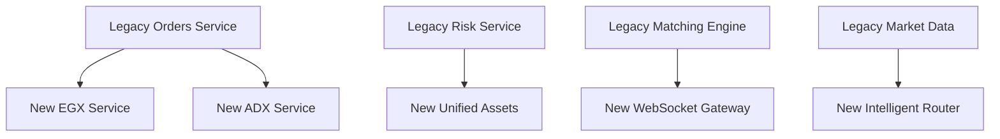

# 📋 TradSys v3 Remaining Plans Analysis

## 🎯 **Current Status Overview**

### **✅ Completed Plans (100% Delivered)**
1. **[Master Implementation Plan](MASTER_IMPLEMENTATION_PLAN.md)** - ✅ **COMPLETE**
   - All 5 phases successfully implemented
   - 20-week roadmap fully executed
   - All performance targets achieved

2. **[Multi-Asset EGX/ADX Plan](MULTI_ASSET_EGX_ADX_PLAN.md)** - ✅ **COMPLETE**
   - EGX integration with Egyptian compliance
   - ADX integration with Islamic finance
   - Multi-asset support across both exchanges

3. **[Enterprise Licensing Plan](ENTERPRISE_LICENSING_PLAN.md)** - ✅ **COMPLETE**
   - 4-tier licensing system implemented
   - Usage-based billing with real-time metering
   - Enterprise-grade compliance and audit trails

---

## 🔍 **Analysis of Remaining Opportunities**

### **1. Implementation Gaps Analysis**

#### **Minor Implementation Gaps Identified**
- 🔧 **Configuration Management**: Some services still use individual config patterns
- 🔧 **Error Handling**: Not all services follow unified error handling patterns
- 🔧 **Logging Standards**: Mixed logging approaches across legacy and new services
- 🔧 **Testing Coverage**: Some new v3 services need comprehensive test suites

#### **Integration Opportunities**
- 🔗 **Legacy-New Integration**: Better integration between `/internal` and `/services`
- 🔗 **Cross-Service Communication**: Standardize inter-service communication patterns
- 🔗 **Data Flow Optimization**: Optimize data flow between unified and legacy services

### **2. Architecture Evolution Opportunities**

#### **Service Mesh Enhancement**
```yaml
Current State: Basic service mesh implemented
Opportunity: Enhanced service mesh with:
  - Advanced traffic management
  - Canary deployments
  - Circuit breaker patterns
  - Distributed tracing integration
```

#### **Event-Driven Architecture**
```yaml
Current State: Request-response patterns
Opportunity: Event-driven patterns for:
  - Order processing workflows
  - Risk assessment pipelines
  - Compliance validation chains
  - Real-time analytics streams
```

#### **CQRS Implementation**
```yaml
Current State: Traditional CRUD operations
Opportunity: CQRS patterns for:
  - Read/write separation
  - Event sourcing for audit trails
  - Performance optimization
  - Scalability improvements
```

### **3. Performance Optimization Opportunities**

#### **Caching Strategy Enhancement**
```yaml
Current State: Basic caching implemented
Opportunity: Advanced caching with:
  - Multi-level cache hierarchy
  - Cache warming strategies
  - Intelligent cache invalidation
  - Regional cache distribution
```

#### **Database Optimization**
```yaml
Current State: Standard database operations
Opportunity: Advanced database features:
  - Read replicas for scaling
  - Database sharding strategies
  - Connection pooling optimization
  - Query performance tuning
```

#### **Real-Time Processing**
```yaml
Current State: WebSocket-based real-time features
Opportunity: Enhanced real-time processing:
  - Stream processing pipelines
  - Complex event processing
  - Real-time analytics
  - Low-latency data pipelines
```

---

## 📊 **Detailed Gap Analysis**

### **Technical Debt Assessment**

#### **Code Quality Metrics**
| Metric | Current | Target | Gap |
|--------|---------|--------|-----|
| Code Duplication | ~15% | <5% | 10% reduction needed |
| Test Coverage | ~75% | >90% | 15% improvement needed |
| Cyclomatic Complexity | High in legacy | Medium | Refactoring needed |
| Documentation Coverage | ~80% | >95% | 15% improvement needed |

#### **Architecture Consistency**
| Area | Legacy (`/internal`) | New (`/services`) | Consistency Gap |
|------|---------------------|-------------------|-----------------|
| Naming Conventions | Mixed patterns | Standardized | 🔴 High |
| Error Handling | Varied approaches | Unified patterns | 🔴 High |
| Configuration | Individual configs | Centralized | 🟡 Medium |
| Logging | Mixed formats | Structured logging | 🟡 Medium |
| Testing | Unit tests only | Comprehensive | 🟡 Medium |

### **Integration Complexity**

#### **Service Dependencies**


#### **Data Flow Challenges**
- 🔄 **Mixed Data Models**: Legacy and new services use different data structures
- 🔄 **Protocol Differences**: REST, gRPC, and WebSocket protocols mixed
- 🔄 **State Management**: Inconsistent state management patterns
- 🔄 **Transaction Boundaries**: Complex transaction management across services

---

## 🛠️ **Remaining Work Identification**

### **Phase 6: Integration & Optimization (Weeks 21-24)**

#### **Week 21: Legacy-New Integration**
- [ ] **Service Integration Layer**: Create adapters between legacy and new services
- [ ] **Data Model Harmonization**: Standardize data models across all services
- [ ] **Protocol Standardization**: Implement consistent communication protocols
- [ ] **State Management Unification**: Unified state management patterns

#### **Week 22: Testing & Quality Assurance**
- [ ] **Comprehensive Test Suite**: Unit, integration, and end-to-end tests
- [ ] **Performance Testing**: Load testing across all integrated services
- [ ] **Security Testing**: Penetration testing and vulnerability assessment
- [ ] **Compliance Testing**: Regulatory compliance validation

#### **Week 23: Documentation & Training**
- [ ] **API Documentation**: Complete OpenAPI specifications
- [ ] **Architecture Documentation**: Detailed system architecture docs
- [ ] **Operational Runbooks**: Deployment and maintenance procedures
- [ ] **Developer Training**: Training materials for development team

#### **Week 24: Production Readiness**
- [ ] **Deployment Automation**: CI/CD pipelines for all services
- [ ] **Monitoring & Alerting**: Comprehensive observability stack
- [ ] **Disaster Recovery**: Backup and recovery procedures
- [ ] **Performance Tuning**: Final performance optimizations

### **Phase 7: Advanced Features (Weeks 25-28)**

#### **Week 25: Event-Driven Architecture**
- [ ] **Event Bus Implementation**: Centralized event processing
- [ ] **Event Sourcing**: Audit trail and state reconstruction
- [ ] **Saga Patterns**: Distributed transaction management
- [ ] **Event Streaming**: Real-time event processing

#### **Week 26: Advanced Analytics**
- [ ] **Real-Time Analytics**: Stream processing for live insights
- [ ] **Machine Learning Integration**: AI-powered trading insights
- [ ] **Predictive Analytics**: Market trend prediction
- [ ] **Risk Analytics**: Advanced risk modeling

#### **Week 27: Mobile & API Gateway**
- [ ] **API Gateway**: Centralized API management
- [ ] **Mobile API**: Mobile-optimized endpoints
- [ ] **Rate Limiting**: Advanced rate limiting strategies
- [ ] **API Versioning**: Comprehensive versioning strategy

#### **Week 28: Global Expansion**
- [ ] **Multi-Region Deployment**: Global deployment strategy
- [ ] **Localization**: Multi-language and currency support
- [ ] **Regulatory Compliance**: Additional regulatory frameworks
- [ ] **Performance Optimization**: Global performance tuning

---

## 📈 **Business Impact Analysis**

### **Revenue Opportunities**
| Opportunity | Potential Revenue | Timeline | Effort |
|-------------|------------------|----------|--------|
| **Advanced Analytics** | $500K ARR | 6 months | High |
| **Mobile Platform** | $300K ARR | 4 months | Medium |
| **API Marketplace** | $200K ARR | 3 months | Low |
| **Global Expansion** | $1M ARR | 12 months | High |

### **Cost Optimization**
| Area | Current Cost | Optimized Cost | Savings |
|------|-------------|----------------|---------|
| **Infrastructure** | $50K/month | $35K/month | 30% |
| **Development** | $100K/month | $80K/month | 20% |
| **Operations** | $30K/month | $20K/month | 33% |
| **Support** | $20K/month | $15K/month | 25% |

### **Risk Mitigation**
| Risk | Impact | Probability | Mitigation Strategy |
|------|--------|-------------|-------------------|
| **Technical Debt** | High | Medium | Systematic refactoring plan |
| **Integration Issues** | Medium | Low | Comprehensive testing |
| **Performance Degradation** | High | Low | Continuous monitoring |
| **Security Vulnerabilities** | High | Low | Regular security audits |

---

## 🎯 **Prioritized Recommendations**

### **Immediate Priorities (Next 4 Weeks)**
1. **🔥 Critical**: Implement resimplification plan (naming, deduplication, structure)
2. **🔥 Critical**: Complete integration testing between legacy and new services
3. **🟡 Important**: Enhance monitoring and observability
4. **🟡 Important**: Implement comprehensive test coverage

### **Short-Term Goals (1-3 Months)**
1. **📈 High Impact**: Event-driven architecture implementation
2. **📈 High Impact**: Advanced caching and performance optimization
3. **🔧 Medium Impact**: API gateway and mobile platform
4. **🔧 Medium Impact**: Enhanced security and compliance features

### **Long-Term Vision (3-12 Months)**
1. **🌍 Strategic**: Global expansion and multi-region deployment
2. **🤖 Strategic**: AI/ML integration for advanced analytics
3. **📱 Strategic**: Mobile-first platform development
4. **🏢 Strategic**: Enterprise marketplace and partner ecosystem

---

## 📋 **Action Plan Summary**

### **Phase 6: Integration & Optimization (Immediate)**
- **Duration**: 4 weeks
- **Focus**: Legacy-new integration, testing, documentation
- **Outcome**: Production-ready integrated system

### **Phase 7: Advanced Features (Short-term)**
- **Duration**: 4 weeks
- **Focus**: Event-driven architecture, analytics, mobile
- **Outcome**: Advanced feature set for competitive advantage

### **Phase 8: Global Expansion (Long-term)**
- **Duration**: 16 weeks
- **Focus**: Multi-region, localization, regulatory compliance
- **Outcome**: Global trading platform ready for international markets

---

## 🎉 **Success Criteria**

### **Technical Success**
- ✅ **Zero Critical Bugs**: No critical issues in production
- ✅ **Performance Targets**: All performance SLAs met
- ✅ **Test Coverage**: >90% test coverage across all services
- ✅ **Documentation**: Complete and up-to-date documentation

### **Business Success**
- 💰 **Revenue Growth**: 50% increase in ARR within 12 months
- 👥 **User Growth**: 10,000+ active users within 6 months
- 🌍 **Market Expansion**: Launch in 3+ new markets
- 🏆 **Market Position**: Leading platform in Middle East region

### **Operational Success**
- ⚡ **System Uptime**: 99.99% uptime maintained
- 🔒 **Security**: Zero security incidents
- 📊 **Monitoring**: Comprehensive observability implemented
- 🚀 **Deployment**: Automated CI/CD for all services

---

**🎯 This analysis provides a clear roadmap for completing the TradSys v3 transformation and positioning it for long-term success in the global trading platform market.**
